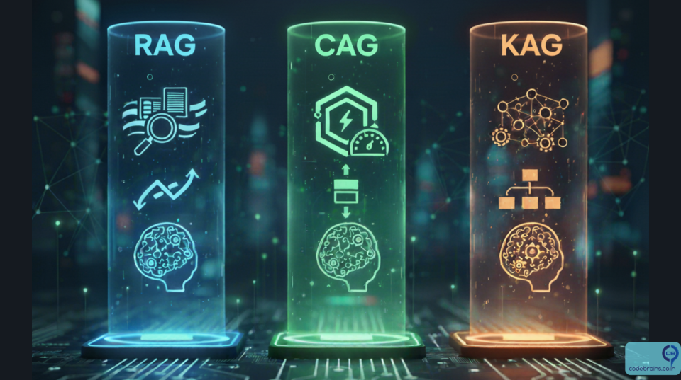
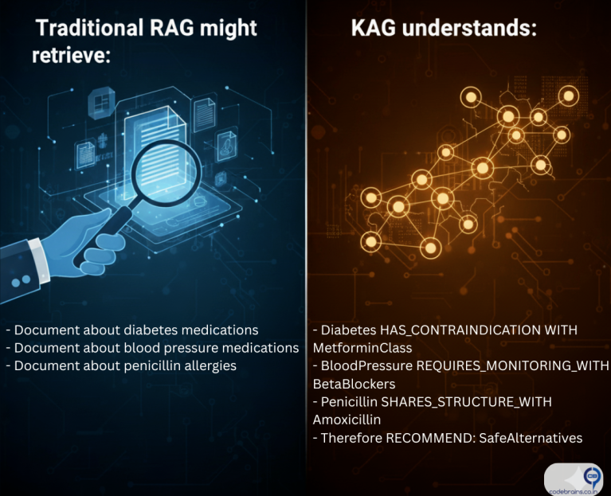
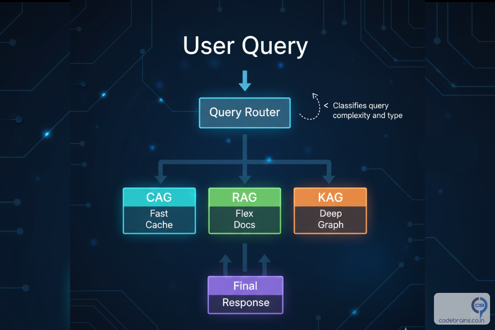

# RAG vs CAG vs KAG: Choosing the Right Augmentation Strategy for Your AI System

*By Ankit Gubrani on October 06, 2025*

So you've built your first RAG system following [our guide to RAG fundamentals](https://www.codebrains.co.in/blog/2025/ai/what-is-rag-retrieval-augmented-generation-guide). It's working. Your chatbot can answer questions about your documentation, your customer support team is happy, and you're feeling pretty good about this whole AI thing. Then reality hits.

Your users start complaining about slow response times. You notice the system retrieving the same documents over and over for common questions. And when someone asks a complex question that requires connecting multiple pieces of information? Your RAG system kind of falls apart.

Here's the truth nobody tells you upfront: **RAG isn't always the answer**. Sometimes you need CAG. Sometimes you need KAG. And most of the time, actually you need a combination of all three.

In this post, we'll break down when to use each approach, why they exist, and how to choose the right strategy for your specific use case. No buzzwords, no hand-waving. Just practical guidance you can use today.

## The Problem with "RAG for Everything"

Let's start with a hard truth: RAG has limitations. If you've been running a RAG system in production, you've probably noticed one or more of these issues:

- **Latency Problems:** Every query triggers a vector search, retrieval, and then generation. That's fine for occasional queries, but what happens when 100 users ask "What are your business hours?" within the same hour? You're doing the same expensive retrieval operation 100 times.
- **Lack of Reasoning:** RAG retrieves relevant chunks, but it doesn't understand relationships between concepts. Ask it "Which products in our catalog are suitable for customers who bought Product X?" and it struggles because it can't reason about product relationships it can only retrieve individual product descriptions.
- **Context Overload:** When a query requires information from 20 different documents, RAG tries to stuff all that context into the LLM's prompt. This leads to longer processing times, higher costs, and often worse answers because the LLM gets overwhelmed.
- **No Memory of Patterns:** Your system answers the same frequently asked questions thousands of times, re-retrieving and re-generating identical responses. That's not just inefficient it's wasteful.

These aren't failures of RAG. They're just signs that you need a more sophisticated approach. Enter CAG and KAG.

## Understanding the Three Approaches

### RAG: Retrieval-Augmented Generation (The Bridge)

*Quick Recap:* RAG connects your LLM to external data sources by retrieving relevant documents and using them as context for generation. It's the bridge between static model knowledge and dynamic, up-to-date information.

**Best For:**
1. Dynamic content that changes frequently
2. Large document collections where you can't predict what users will ask
3. Scenarios where you need recent information (news, updates, changelogs)

**Example Use Case:** A documentation chatbot where engineers ask questions about different API endpoints. The docs change weekly, and queries are unpredictable.

### CAG: Cache-Augmented Generation (The Memory)

CAG is all about efficiency and speed. Instead of retrieving and generating fresh responses every time, CAG caches frequently accessed results. Think of it as giving your AI system a short-term memory.

**How It Works:**
1. User asks a question
2. System checks if an identical or semantically similar question has been asked before
3. If yes, return the cached response instantly
4. If no, perform retrieval/generation and cache the result

**Best For:**
- High-traffic applications with repetitive queries
- Use cases with a predictable set of common questions

**Example Use Case:** An e-commerce chatbot where 70% of queries are variations of *"What's your return policy?"* or *"How do I track my order?"* Cache those answers and serve them in milliseconds instead of seconds.

**Key Insight:** CAG doesn't replace RAG it sits in front of it. You still need RAG for the long tail of unique queries. CAG just makes your most common queries blazingly fast.

### KAG: Knowledge-Augmented Generation (The Reasoner)

KAG takes a fundamentally different approach. Instead of retrieving raw documents, it works with structured knowledge think of knowledge graphs, entity relationships. KAG excels when you need reasoning, not just retrieval.

**How It Works:**
1. Information is stored as a knowledge graph (entities + relationships)
2. When a query comes in, the system traverses the graph to find connected information
3. When a query comes in, the system traverses the graph to find connected information

**Best For:**
- Complex queries requiring multi-hop reasoning
- Domain-specific applications (medical diagnosis, legal analysis, financial recommendations)
- Scenarios where understanding relationships is critical

**Example Use Case:**

A healthcare assistant that needs to answer "What medications are safe for a patient with diabetes and high blood pressure who is allergic to penicillin?" This requires reasoning about:
- Drug interactions
- Condition compatibility
- Allergy cross-reactions

A knowledge graph can encode these relationships explicitly, allowing the system to traverse from conditions → contraindications → safe alternatives.

**Key Insight:** KAG is about depth and reasoning. It's overkill for simple question-answering but essential when your domain has complex interconnected rules.

## Real-World Scenarios with Recommendations:

Here's a practical guide to choosing the right augmentation strategy based on your specific scenario:

| Scenario | Recommended Approach | Why |
|----------|---------------------|-----|
| Customer support FAQ bot | CAG + RAG | Most queries are repetitive (returns, shipping, account issues). Cache common ones, RAG for unique questions. |
| Legal document analysis | KAG | Requires understanding precedents, case relationships, and complex legal reasoning. |
| Company wiki Q&A | RAG | Content changes frequently, queries are unpredictable, no complex reasoning needed. |
| Medical diagnosis assistant | KAG + RAG | KAG for symptom-disease-treatment relationships, RAG for latest research papers. |
| E-commerce product recommendations | KAG + CAG | KAG for understanding customer-product relationships, CAG for popular "best sellers in category X" queries. |
| News summarization | RAG | Content is constantly fresh, retrieval of recent articles is the core value. |

## Real-World Example: Building a Product Support System

Let's see how these approaches work in practice with the same use case: a product support chatbot for a SaaS company.

### Scenario: Codebrains.co.in Support Bot

Codebrains.co.in sells project management software. They get thousands of support queries daily.

#### Query Type Breakdown:
- 60% common questions ("How do I reset my password?", "What's included in Pro plan?")
- 30% product-specific questions ("How do I integrate with Slack?")
- 10% complex troubleshooting ("Why aren't my notifications working when I have filters enabled and I'm using SSO?")

#### Implementation Strategy:

**Layer 1: CAG** (Handles 60% of queries)
- Cache these high-frequency queries:
  - Authentication & account issues
  - Pricing & plan questions
  - Basic feature explanations
- Result: 200ms response time

**Layer 2: RAG** (Handles 30% of queries)
- Retrieve from documentation:
  - Integration guides
  - Feature documentation
  - API references
- Result: 2-3 second response time

**Layer 3: KAG** (Handles 10% of queries)
- Knowledge graph contains:
  - Feature dependencies
  - Known bug patterns
  - Configuration interactions
- Result: 4-5 second response time

**Final Result**: Fast & Accurate responses to all query types

## Hybrid Approaches: Why You'll Probably Need All Three

Here's what nobody tells you: **most production systems use a combination of all three approaches**. The magic isn't in choosing one it's in orchestrating them intelligently.

### The Hybrid Architecture Pattern:

## Building Blocks: What You Need for Each Approach

### To Implement CAG:
- Semantic similarity search (to match similar queries)
- Cache store (Redis, Memcached, or specialized semantic cache)
- TTL (time-to-live) strategy for freshness
- Cache invalidation logic when content updates

**Start Simple:** Even a basic Redis cache with exact query matching can reduce load by 40-50%.

### To Implement RAG:
- Vector database (Pinecone, ChromaDb, Weaviate)
- Embedding model (OpenAI, Cohere, or open-source)
- Document chunking strategy
- Retrieval scoring and ranking

**Start Simple:** Use a managed vector DB and OpenAI embeddings. Optimize later.

### To Implement KAG:
- Knowledge graph database (Neo4j, AWS Neptune)
- Entity extraction pipeline
- Relationship definition
- Graph traversal logic

**Start Simple:** Begin with a small, curated graph for your core domain concepts. Expand as you identify patterns.

## Common Pitfalls and How to Avoid Them

### Pitfall 1: Over-caching with CAG
**Problem:** Caching stale information that's changed.
**Solution:** Implement smart TTL based on content type:
- Product pricing: 1 hour TTL
- Documentation: 24 hour TTL
- News/updates: 5 minute TTL

### Pitfall 2: Building KAG Too Early
**Problem:** Spending months building a knowledge graph before validating if you need it.
**Solution:** Start with RAG. Only move to KAG when you have clear evidence that:
- Users ask questions requiring multi-hop reasoning
- Your domain has well-defined relationships
- RAG is consistently failing on relationship-based queries

### Pitfall 3: Ignoring the Hybrid Approach
**Problem:** Treating these as mutually exclusive choices.
**Solution:** Think in layers. Start with RAG, add CAG for performance, introduce KAG for specific complex query types.

## Key Takeaways: Making the Right Choice

Here's what you need to remember:
- **RAG is your foundation:** Start here for any document-based Q&A system. It's flexible, proven, and handles the unpredictable.
- **CAG is your performance layer:** Add it when response time matters and you see query patterns. It's not about capability—it's about efficiency.
- **KAG is your reasoning engine:** Introduce it when your domain has structured relationships and users need answers that require connecting multiple concepts.
- **Think in layers, not alternatives:** The best systems use all three, routed intelligently based on query characteristics.
- **Start simple, evolve based on data:** Don't build the perfect architecture on day one. Launch with RAG, instrument heavily, and add CAG/KAG when you have evidence they're needed.
- **Cache everything you can:** Whether it's CAG for responses or cached embeddings in RAG, caching is the easiest performance win.

## What's Next?

Now you know when to choose RAG, CAG, or KAG or more likely, how to combine them. But there's another critical piece of the puzzle: **vector databases**. How do you choose the right one? How do you optimize retrieval for accuracy and speed? That's what we'll tackle in the next post.

In the meantime, here's your action item: **Look at your current system (or the one you're planning)**.
- What percentage of your queries are repetitive? (CAG opportunity)
- Do users ask questions that require reasoning about relationships? (KAG opportunity)
- Are you starting from scratch? (Start with RAG)

The right augmentation strategy isn't about following trends it's about matching technical approaches to your actual user needs and query patterns.

What challenges are you facing with your AI system? Are you seeing performance issues with RAG? Struggling with complex queries? I'd love to hear about your specific use cases connect with me on [LinkedIn](https://www.linkedin.com/in/ankitgubrani/).