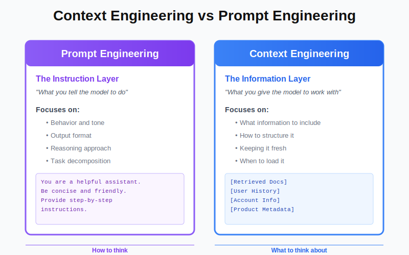
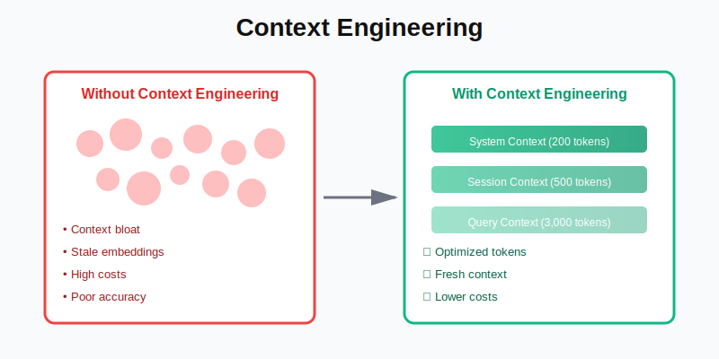
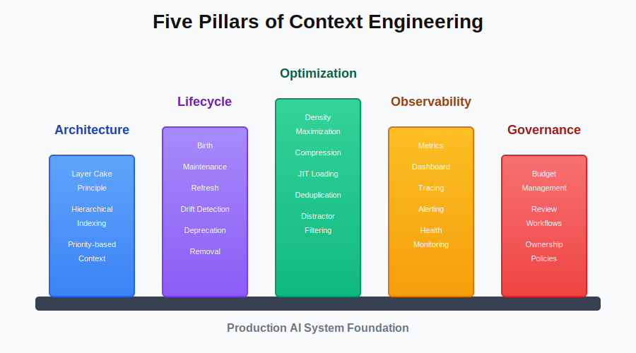

You've built your RAG system following [our guide to RAG fundamentals](https://www.codebrains.co.in/blog/2025/ai/what-is-rag-retrieval-augmented-generation-guide "https://www.codebrains.co.in/blog/2025/ai/what-is-rag-retrieval-augmented-generation-guide"). You've implemented [MCP](https://www.codebrains.co.in/blog/2025/ai/model-context-protocol-the-universal-adapter-your-ai-stack-actually-needs "https://www.codebrains.co.in/blog/2025/ai/model-context-protocol-the-universal-adapter-your-ai-stack-actually-needs") for clean data integration. You understand [context rot](https://www.codebrains.co.in/blog/2025/ai/context-rot-silent-performance-killer-in-your-rag-system "https://www.codebrains.co.in/blog/2025/ai/context-rot-silent-performance-killer-in-your-rag-system") and you've even implemented some prevention strategies.

But here's what nobody tells you when you're starting out: **building an AI system is easy. Building one that stays intelligent over time? That's the hard part.**

Your AI worked brilliantly on day one. You carefully crafted prompts, selected relevant documents, and tested thoroughly. Six months later, you're debugging why the same system now gives mediocre answers to the same questions. The model didn't change. The data didn't disappear. So what happened?

What happened is that you treated context as an afterthought instead of a first-class engineering discipline. You wouldn't build a production system without thinking about database design, API architecture, or error handling. **Yet most teams build AI systems without thinking deeply about context design.**

That's what context engineering solves. **It's the practice of deliberately designing, managing, and optimizing what information flows into your AI's context window.** It's about treating context as a scarce, valuable resource that requires the same level of architectural thinking you apply to any other critical system component.

## What is Context Engineering?

Context engineering is the systematic discipline of designing, constructing, and maintaining the information environment that an AI model operates within. **Think of it like this: if your LLM is a chef, context engineering is the entire kitchen design what ingredients are within reach, how they're organized, what tools are available, and how everything stays fresh and accessible.**

From a technical standpoint, context engineering encompasses:

* **Context Architecture**: How you structure and organize information before it reaches the model
* **Context Lifecycle Management**: How context evolves, refreshes, and expires over time
* **Context Optimization**: Techniques for maximizing information density while minimizing noise
* **Context Observability**: Instrumentation and metrics for understanding context health
* **Context Governance**: Policies, controls, and workflows for managing context quality

It's the difference between randomly throwing information at an LLM and deliberately crafting an information environment that enables peak performance.

## Context Engineering vs Prompt Engineering: Understanding the Distinction

If you've been working with AI, you're probably familiar with prompt engineering. So what's the difference, and why does it matter?

**Prompt Engineering** is about crafting the instruction layer. It's what you tell the model to do:

```
You are a helpful customer support assistant. Be concise and friendly. 
When answering questions, provide step-by-step instructions.
Always cite your sources.
```

Prompt engineering focuses on: behavior, tone, output format, reasoning approach, and task decomposition.

**Context Engineering** is about crafting the information layer. It's what you give the model to work with:

```
[Retrieved Documentation Chunks]
[User's Conversation History]
[Account Information]
[Product Metadata]
```

Context engineering focuses on: what information to include, how to structure that information, how to keep it fresh and relevant, how much to include, and when to load it.



### Why Both Matter

**Here's the key insight: a brilliant prompt with terrible context produces mediocre results. A basic prompt with well-engineered context produces excellent results.**

**Example scenario:** User asks "How do I reset my password?"

**Prompt Engineering Alone:**

```
Prompt: "You are a helpful assistant. Answer the user's question clearly."
Context: [Your entire 50,000-word documentation dumped in]
Result: Slow, expensive, potentially inaccurate (information overload)
```

**Context Engineering + Prompt Engineering:**

```
Prompt: "You are a helpful assistant. Answer based on the provided documentation."
Context: [Only the 3 most relevant chunks about password reset, 500 tokens total]
Result: Fast, accurate, cost-effective
```

The prompt didn't change much. The context engineering made all the difference.

### The Relationship

Think of them as complementary disciplines:

* **Prompt engineering** teaches the model how to think
* **Context engineering** gives the model what to think about



Most teams over-invest in prompt engineering and under-invest in context engineering. They spend weeks tweaking prompts, trying to get the model to "understand better," when the real problem is that they're drowning the model in irrelevant context.

Master both. But if you had to choose where to focus first? Context engineering has higher ROI for production systems.

## Why Context Engineering Matters More Than You Think

Let's be honest: **most AI projects fail not because the model isn't good enough, but because the context is poorly managed.** The model is brilliant. Your retrieval returns relevant documents. But somehow the final output is disappointing. Why?

**Because good context engineering is invisible, but bad context engineering is catastrophic.**

Here's what happens without context engineering discipline:

### Scenario: The Documentation Chatbot That Stopped Working

A SaaS company builds a documentation chatbot. Launch day: 94% accuracy, users love it. Three months later: 76% accuracy, users complaining about vague answers.

What changed? Nothing intentional. But here's what actually happened:

* Documentation grew from 200 pages to 800 pages (4x more potential noise)
* Marketing added 50 blog posts about features (relevant but dilutes precision)
* Support team created 100 troubleshooting articles (overlaps with documentation)
* Product team published release notes for every update (creates temporal confusion)
* No one updated embeddings after major product changes (semantic drift)
* No one removed deprecated documentation (stale context)
* No one deduplicated similar content across sources (redundant context)

Each change was rational in isolation. Collectively, they destroyed the chatbot's effectiveness. **This is what happens without context engineering.**

### The Hidden Cost of Poor Context Management

Poor context engineering compounds into multiple failure modes:

* **Accuracy Degradation**: The signal-to-noise ratio drops, models struggle to identify relevant information
* **Latency Inflation**: More context = more tokens = slower responses and higher costs
* **Maintenance Nightmare**: Every change to your knowledge base requires manual testing to ensure quality doesn't degrade
* **Team Frustration**: Engineers spend more time debugging **"why did the AI say that?"** than building features

Context engineering prevents these problems through systematic design and continuous management.

## The Five Pillars of Context Engineering

Effective context engineering rests on five foundational pillars. **Master these, and your AI system stays sharp over time. Ignore them, and you're doomed to context rot.**

### Pillar 1: Context Architecture

Context architecture is about how you structure information before it ever reaches the model. **It's not about what you include, it's about how you organize what you include.**

#### The Layer Cake Principle

Think of context as layers of specificity, from general to specific:

**Layer 1: System Context** (Always present, rarely changes)  
Model capabilities and limitations, response format requirements, safety guardrails and policies, domain-specific knowledge that applies universally.

Example: "You are a customer support assistant for an e-commerce platform. Always be helpful, concise, and accurate. Never share personal customer information."

**Layer 2: Session Context** (Persists during conversation)  
User's conversation history, established preferences or requirements, accumulated understanding of the user's goal.

Example: "The user is asking about order #12345. Previous context: they mentioned the item arrived damaged."

**Layer 3: Query Context** (Specific to current query)  
Retrieved documents from vector search, real-time data from APIs or databases, dynamically loaded resources via MCP.

Example: "Order #12345 details: [status, items, shipping info]. Return policy: [relevant section]. Previous support tickets for this order: [none]."

This layered approach prevents context bloat. **System context is minimal and static. Session context grows controlled. Query context is laser-focused.**

#### Hierarchical Context Indexing

Not all context has equal importance. Context engineering requires explicit prioritization:

```
Priority 1 (Critical): User's actual question, directly relevant retrieved chunks
                Priority 2 (Important): User's recent conversation history, related documentation
                Priority 3 (Supplementary): Background information, tangentially related content
                Priority 4 (Optional): General knowledge, fallback information
```

When you hit context limits, you drop Priority 4, then 3, then 2. **Priority 1 is sacred.**



### Pillar 2: Context Lifecycle Management

Context isn't static. **It's born, lives, ages, and eventually needs to die.** Context lifecycle management treats context as a living thing that requires active maintenance.

#### Context Birth: Creation and Ingestion

When new content enters your system, context engineering asks:

* What's the source and authority level? (Internal docs > external blogs)
* What's the temporal relevance? (Product docs > historical announcements)
* What's the granularity? (Should this be one chunk or five?)
* What metadata matters? (Version, last updated, author, category)

Example: When ingesting product documentation:

#### Context Life: Maintenance and Refreshing

Context doesn't stay relevant forever. Context engineering requires active maintenance:

**Time-Based Refresh**

* Critical documentation: Weekly embedding refresh
* Product features: Monthly refresh after releases
* General content: Quarterly refresh
* Archived content: Annual validation (delete if outdated)

**Event-Based Refresh**

* Trigger re-embedding when source documents change
* Update metadata when product versions increment
* Refresh related content when dependencies change

**Semantic Drift Detection**

Monitor how your embeddings drift over time:

```
def detect_semantic_drift(doc_id):
            old_embedding = get_embedding(doc_id, version='current')
            new_embedding = recompute_embedding(doc_id)
            
            similarity = cosine_similarity(old_embedding, new_embedding)
            
            if similarity &lt; 0.85:
                flag_for_review(doc_id, 'significant_semantic_drift')
                trigger_refresh_cascade(doc_id)  # refresh related docs too
```

#### Context Death: Deprecation and Removal

Bad context is worse than no context. **Context engineering requires ruthless deletion:**

Deprecation triggers:

* Content is older than its relevance horizon (e.g., release notes from 2 years ago)
* Content contradicts newer information
* Content hasn't been retrieved in 6 months (low value)
* Content causes retrieval conflicts (increases confusion)

Don't archive indefinitely. **Delete. Your AI will thank you.**

### Pillar 3: Context Optimization

Optimization is about getting maximum value from every token in your context window. **It's the difference between sending 10,000 tokens and getting mediocre results versus sending 3,000 tokens and getting brilliant results.**

#### Information Density Maximization

**Every token should earn its place.** Here's how to maximize density:

**Technique 1: Aggressive Summarization**

Don't send full documents. Send summaries with pointers to details:

Instead of:

```
"Our return policy allows customers to return items within 30 days of purchase. 
Items must be in original condition. Refunds are processed within 5-7 business days. 
Shipping costs are non-refundable unless the item was defective..."
[500 more words]
```

Send:

```
"Return policy: 30 days, original condition required, 5-7 day refund processing. 
[Full details: doc_id=returns_policy_v3.2]"
```

The LLM gets the key facts. If it needs details, it can request the full document via MCP.

**Technique 2: Contextual Compression**

Remove redundancy across retrieved chunks:

```
def compress_context(chunks):
    # Remove duplicate sentences across chunks
    unique_sentences = deduplicate_sentences(chunks)
                
    # Remove boilerplate (headers, footers, common disclaimers)
    filtered = remove_boilerplate(unique_sentences)
                
    # Merge semantically similar sentences
    compressed = merge_similar_sentences(filtered, threshold=0.92)
                
    return compressed
```

**Technique 3: Just-In-Time Context Loading**

Don't pre-load context you might not need. Load progressively:

Initial context (minimal):

```
- User's query
- Top 3 most relevant chunks
- Conversation history (last 2 turns)
Total: ~1,000 tokens
```

If the LLM needs more:

```
LLM: "I need more context about authentication flows"
System: *loads additional auth documentation*
Total: now ~2,500 tokens
```

This prevents over-contexting while ensuring completeness.

#### Noise Reduction Strategies

Optimization isn't just about compression it's about eliminating noise:

**Strategy 1: Semantic Deduplication**

Your vector database might return five chunks that say essentially the same thing. Send only one:

```
def semantic_deduplicate(chunks, threshold=0.90):
    unique = []
    for chunk in chunks:
        is_duplicate = any(
            cosine_similarity(chunk.embedding, u.embedding) > threshold
            for u in unique
        )
        if not is_duplicate:
            unique.append(chunk)
        return unique
```

**Strategy 2: Distractor Filtering**

Remember from our discussion on [context rot](https://www.codebrains.co.in/blog/2025/ai/context-rot-silent-performance-killer-in-your-rag-system "https://www.codebrains.co.in/blog/2025/ai/context-rot-silent-performance-killer-in-your-rag-system")? Distractors kill performance. Filter them:

```
def filter_distractors(query, chunks):
            # Score each chunk on relevance to query
            scored_chunks = [
                (chunk, relevance_score(query, chunk))
                for chunk in chunks
            ]
            
            # Keep only chunks above threshold
            relevant = [c for c, score in scored_chunks if score > 0.7]
            
            # Also filter chunks that are topically related but don't answer the query
            focused = [c for c in relevant if answers_query(query, c)]
            
            return focused
```

### Pillar 4: Context Observability

You can't manage what you can't measure. **Context observability is about instrumenting your context pipeline so you understand exactly what's happening.**

#### Context Metrics That Matter

Track these metrics continuously:

* **Volume Metrics**
* **Quality Metrics**
* **Health Metrics**

#### Build a Context Dashboard

Your context health dashboard should show:

```
Context Health Score: 87/100 ⚠️        
    Volume: 
        - Avg tokens/query: 4,200 ✅
        - P95 tokens/query: 12,000 ⚠️ (target: &lt;8,000)        
    Quality:
        - Precision: 72% ⚠️ (target: >80%)
        - Relevance: 0.89 ✅
        - Deduplication: 23% duplicate chunks 🚨        
    Freshness:
        - Avg embedding age: 45 days ✅
        - Stale embeddings (>90 days): 12% ⚠️        
    Alerts:
        - 3 documents with semantic drift >0.15 detected
        - Context size increased 18% in last 30 days
```

This makes context health visible and actionable.

#### Context Tracing

Implement distributed tracing for context:

```
@trace_context
        def build_context(query, user_id):
            with trace_span('retrieve'):
                chunks = vector_search(query, top_k=10)
            
            with trace_span('filter'):
                relevant = filter_distractors(query, chunks)
            
            with trace_span('deduplicate'):
                unique = semantic_deduplicate(relevant)
            
            with trace_span('compress'):
                compressed = compress_context(unique)
            
            trace_log(&#123;
                'original_chunks': len(chunks),
                'after_filtering': len(relevant),
                'after_dedup': len(unique),
                'final_tokens': count_tokens(compressed),
                'query': query,
                'user_id': user_id,
            &#125;)
            
            return compressed
```

This tells you exactly where tokens are coming from and where they're being eliminated.

### Pillar 5: Context Governance

Context governance is about the policies, workflows, and controls that ensure context quality over time. **It's the organizational layer that prevents context from degrading as your system scales.**

#### Context Budget Management

Treat context like you treat memory or CPU **as a limited resource with a budget:**

```
CONTEXT_BUDGETS = &#123;
            'simple_query': &#123;
                'max_tokens': 2000,
                'sources': ['direct_docs'],
                'history_turns': 0,
            &#125;,
            'complex_query': &#123;
                'max_tokens': 5000,
                'sources': ['direct_docs', 'related_docs', 'examples'],
                'history_turns': 3,
            &#125;,
            'personalized_query': &#123;
                'max_tokens': 4000,
                'sources': ['direct_docs', 'user_data'],
                'history_turns': 2,
            &#125;,
        &#125;        def enforce_budget(query_type, context):
            budget = CONTEXT_BUDGETS[query_type]
            
            if count_tokens(context) > budget['max_tokens']:
                # Trim to budget by removing lowest priority items
                context = trim_to_budget(context, budget['max_tokens'])
            
            return context
```

#### Context Review Workflow

Implement a review process for context changes:

When someone wants to add a new data source:

1. Measure current context metrics (baseline)
2. Add new source in A/B test (20% of traffic)
3. Measure impact on accuracy, latency, cost
4. Require 5% improvement in accuracy OR 20% cost reduction to approve
5. If approved, gradually roll out to 100%
6. If rejected, document why and what would make it viable

This prevents the "just add more context" trap.

#### Context Ownership

Assign clear ownership:

* **Context Architect**: Designs overall context strategy and policies
* **Context Engineers**: Implement and maintain context pipelines
* **Content Owners**: Responsible for accuracy and freshness of their content
* **Context Auditors**: Regularly review context health and compliance

Without ownership, everyone assumes someone else is managing context. **Result: nobody is.**

## Context Engineering Patterns: Solutions to Common Problems

Let's explore proven patterns for common context challenges.

### Pattern 1: The Tiered Retrieval Pipeline

**Problem**: Simple queries waste tokens on deep retrieval. Complex queries need more context than you're providing.

**Solution**: Tiered retrieval that matches context depth to query complexity.

```
def tiered_retrieval(query):
                # Tier 1: Fast, shallow retrieval
                quick_results = vector_search(query, top_k=3, fast_index=True)
                
                # Classify query complexity
                complexity = classify_complexity(query)
                
                if complexity == 'simple':
                    return quick_results  # Done, 3 chunks is enough
                
                # Tier 2: Deeper search for complex queries
                if complexity == 'complex':
                    deep_results = vector_search(query, top_k=10, accurate_index=True)
                    
                    # Maybe we need cross-document reasoning
                    if requires_synthesis(query):
                        # Tier 3: Full context assembly
                        related = fetch_related_documents(deep_results)
                        return assemble_context(deep_results, related)
                    
                    return deep_results
                
                return quick_results
```

This prevents over-retrieval for simple queries while ensuring complex queries get sufficient context.

### Pattern 2: Context Versioning

**Problem**: Your product updates but your context includes both old and new information. Models get confused.

**Solution**: Version-aware context that filters based on temporal relevance.

```
def version_aware_retrieval(query, user_version):
            # Retrieve as usual
            chunks = vector_search(query, top_k=20)
            
            # Filter by version compatibility
            compatible = [
                c for c in chunks
                if is_compatible(c.metadata['version'], user_version)
            ]
            
            # If user is on old version, include migration guidance
            if user_version &lt; CURRENT_VERSION:
                migration_docs = get_migration_docs(user_version, CURRENT_VERSION)
                compatible.extend(migration_docs)
            
            return compatible
```

### Pattern 3: Dynamic Context Composition

**Problem**: Different query types need different context combinations.

**Solution**: Query-aware context assembly.

```
def compose_context(query, user):
            query_type = classify_query(query)
            
            context_components = &#123;
                'troubleshooting': [
                    ('docs', get_troubleshooting_docs(query)),
                    ('common_issues', get_common_issues(query)),
                    ('user_history', get_user_issues(user)),
                ],
                'how_to': [
                    ('docs', get_documentation(query)),
                    ('examples', get_code_examples(query)),
                ],
                'account': [
                    ('account_info', get_account_info(user)),
                    ('policies', get_relevant_policies(query)),
                ],
            &#125;
            
            components = context_components.get(query_type, [])
            
            # Assemble with proper weights
            context = weighted_assembly(components)
            
            return context
```

### Pattern 4: Context Caching with Invalidation

**Problem**: Re-embedding and re-retrieving for similar queries wastes resources.

**Solution**: Smart caching with proactive invalidation.

```
class ContextCache:
            def get_context(self, query, user):
                # Check if we have cached context for similar query
                cache_key = self.compute_cache_key(query, user)
                
                cached = self.cache.get(cache_key)
                if cached and not self.is_stale(cached):
                    return cached.context
                
                # Build fresh context
                context = build_context(query, user)
                
                # Cache with dependencies
                self.cache.set(cache_key, context, dependencies=[
                    *context.source_docs,
                    user.id,
                ])
                
                return context
            
            def invalidate_dependencies(self, doc_id):
                # When a document updates, invalidate all cached contexts using it
                self.cache.invalidate_where(lambda c: doc_id in c.dependencies)
```

This is the perfect segue to our next topic: Semantic Cache, which takes this pattern even further.

## The Cost of Ignoring Context Engineering

Let's be brutally honest about what happens when you don't engineer context deliberately.

### Financial Waste

**Context tokens cost money.** If you're sending 10x more tokens than necessary because of poor context engineering, you're burning 10x more cash.

For example: If a company with 1M queries/month, sending 12,000 tokens per query instead of 3,000:

* Wasteful cost: lets say pays ~$180k/year
* Optimized cost: might come down to ~$45k/year
* **Savings: $135k/year** just from context engineering

### Competitive Disadvantage

Your competitors are building faster, more accurate AI systems. If your system is slow and inaccurate because of poor context management, you lose.

**Users don't care about your technical challenges. They compare your AI to the best AI they've used. If yours is worse, they churn.**

### Engineering Velocity

Poor context engineering creates a maintenance nightmare. Engineers spend more time debugging "why did the AI say that?" than shipping features.

**Every context-related bug is a drain on velocity. With proper context engineering, context "just works" and engineers can focus on actual product development.**

### User Trust Erosion

Every time your AI gives a wrong answer because of stale context or provides a vague answer because of context noise, you erode user trust.

**Trust is hard to build and easy to lose. Context engineering is about maintaining the trust your users have in your AI system.**

## Context Engineering in the Age of Long Context Windows

Modern LLMs support massive context windows. GPT-4.1: 1 million tokens. Gemini 1.5 Pro: 2 million tokens. Claude Opus 4: 1 million tokens. Does this make context engineering obsolete?

**Absolutely not. It makes it more important.**

### Why Long Context Doesn't Solve the Problem

Bigger context windows don't mean "dump everything and hope for the best." **Research consistently shows:**

* Performance degrades as context length increases, even when the model can technically process it
* Cost scales linearly with tokens (2x context = 2x cost)
* Latency increases with context size
* The "needle in a haystack" problem gets worse with more hay

Long context windows give you more rope. **Without context engineering, you'll hang yourself with it.**

### The Right Way to Use Long Context

Long context windows are a tool, not a solution. Use them strategically:

**Good uses**:

* Processing entire documents when you need full coherence (e.g., analyzing a contract)
* Maintaining conversation history for complex, multi-turn interactions
* Holding comprehensive schemas or reference material for coding tasks

**Bad uses**:

* Sending your entire knowledge base because "the model can handle it"
* Pre-loading context "just in case" the model needs it
* Avoiding retrieval optimization because "context is cheap now"

Context engineering discipline matters even more with long context windows because the consequences of poor management are amplified.

## Integrating Context Engineering with Your Existing Stack

You don't need to rebuild everything to implement context engineering. Here's how to integrate with what you already have.

### If You're Using RAG

Context engineering enhances RAG:

* Apply tiered retrieval to your vector search
* Implement semantic deduplication before sending chunks to LLM
* Add context lifecycle management to your embedding pipeline
* Build observability for your retrieval metrics

### If You're Using MCP

MCP and context engineering are complementary:

* Use MCP for dynamic, on-demand context loading
* Implement context budgets for MCP resource requests
* Add versioning metadata to MCP resources
* Build MCP servers that expose context health metrics

### If You're Using CAG or KAG

Cache and knowledge graphs benefit from context engineering:

* Apply context versioning to cached responses
* Implement cache invalidation based on context freshness
* Optimize knowledge graph traversal to stay within context budgets
* Add context provenance tracking to graph queries

Context engineering is a layer that sits across your entire AI stack, improving everything.

## Getting Started: Your Context Engineering Roadmap

You're convinced. Context engineering matters. But where do you start?

### 1. Audit Your Current Context

Before changing anything, measure where you are:

* What's your average tokens per query?
* What's your context composition? (retrieval vs. history vs. system)
* How old are your embeddings?
* What's your retrieval precision? (% of retrieved chunks actually used)
* What's your duplication rate?

### 2. Establish Context Budgets

Define maximum context sizes for different query types:

* Simple factual queries: 2,000 tokens
* Complex reasoning queries: 5,000 tokens
* Personalized queries: 4,000 tokens

Start enforcing these budgets. **You'll immediately see improvements.**

### 3. Implement Quick Wins

Low-effort, high-impact changes:

* Add semantic deduplication (30 lines of code, 20-40% token reduction)
* Remove conversation history for non-follow-up queries (instant savings)
* Delete deprecated documentation (one-time cleanup)
* Compress system prompts (easy optimization)

### 4. Build Observability

You need visibility:

* Add token counting to every query
* Track retrieval metrics (precision, recall, diversity)
* Build a basic context health dashboard
* Set up alerts for anomalies

### 5. Implement Lifecycle Management

Now address long-term health:

* Set up embedding refresh workflows
* Implement version-aware retrieval
* Add semantic drift detection
* Create deprecation workflows for stale content

### 6. Optimize and Govern

With fundamentals in place, optimize:

* Implement tiered retrieval
* Add dynamic context composition
* Build A/B testing framework for context changes
* Establish governance policies and ownership

This roadmap gets you from "context is an afterthought" to "context is a core competency" in four months.

## Key Takeaways: What You Need to Remember

Here's what matters about context engineering:

* **Context is a first-class architectural concern**: Stop treating it as an afterthought. Design it deliberately like you design databases or APIs.
* **Context engineering prevents context rot**: Without active management, your system degrades over time. Context engineering makes degradation visible and preventable.
* **Small changes have massive impact**: Semantic deduplication alone can reduce tokens by 30%. Removing stale content can improve accuracy by 10-15%.
* **Observability is non-negotiable**: You can't manage what you don't measure. Instrument your context pipeline from day one.
* **Context governance prevents regression**: Without policies and ownership, well-engineered context slowly degrades back to chaos.
* **Long context windows don't eliminate the need**: More context capacity doesn't mean you should use it carelessly. Context engineering matters even more.
* **Integration is incremental**: You don't need to rebuild everything. Start with quick wins and progressively improve.

The best time to implement context engineering was when you launched your AI system. **The second best time is now.**

## What's Next

You now understand how context engineering works, why it matters, and how to implement it in your AI systems. But here's a question that follows naturally: **what about queries you've already answered?**

Every time a user asks "What's your return policy?" **your system goes through the entire context engineering pipeline: retrieval, deduplication, compression, assembly.** That's thorough, but it's also wasteful. What if you could recognize semantically similar queries and serve optimized responses instantly?

That's where **Semantic Cache** comes in. **In our next blog, we'll explore how semantic caching takes context engineering to the next level. Unlike traditional caching (which only matches exact queries), semantic cache understands meaning.** It recognizes that "How do I return an item?" and "What's your return policy?" are asking the same thing, and it can serve cached responses immediately while still maintaining freshness and accuracy.

We'll dive into how semantic cache works, when it makes sense, and how to implement it without the pitfalls of stale responses. **It's the natural evolution of context engineering, combining the precision of well-engineered context with the efficiency of intelligent caching.**

What's your experience with context engineering in production AI systems? Are you dealing with context bloat, stale embeddings, or poor retrieval precision? Are you already implementing any of these patterns? I'd love to hear about your experiences and challenges connect with me on [LinkedIn](https://www.linkedin.com/in/ankitgubrani/ "https://www.linkedin.com/in/ankitgubrani/").