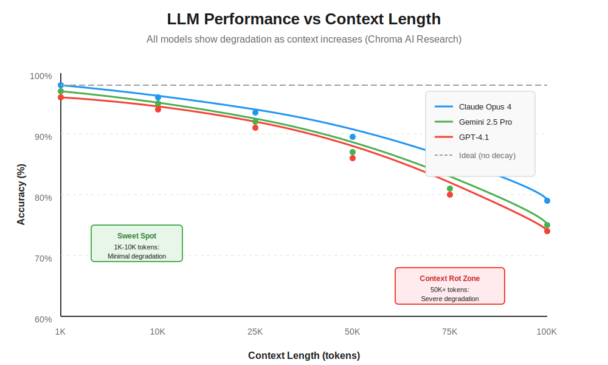
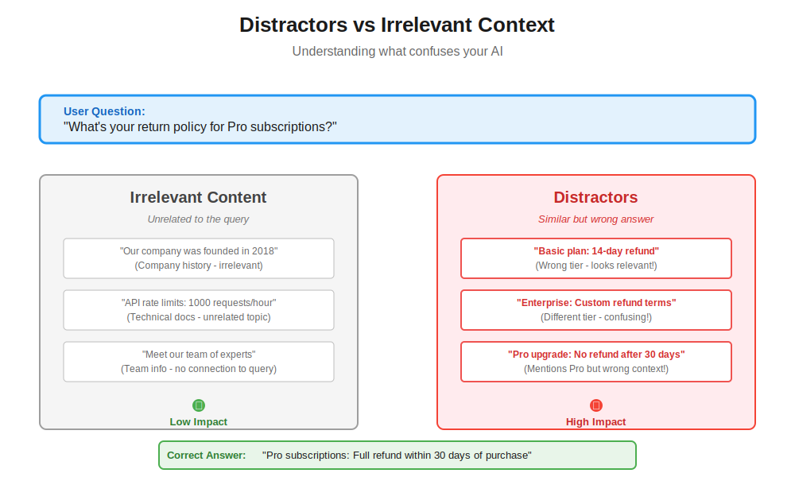
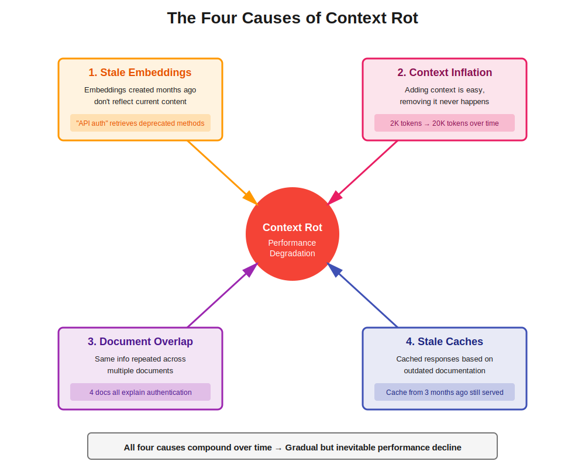

You've built your RAG system following [our guide to RAG fundamentals](https://www.codebrains.co.in/blog/2025/ai/what-is-rag-retrieval-augmented-generation-guide "https://www.codebrains.co.in/blog/2025/ai/what-is-rag-retrieval-augmented-generation-guide").You've set up your [vector database](https://www.codebrains.co.in/blog/2025/ai/vector-databases-search-engine-rag-system-actually-needs "https://www.codebrains.co.in/blog/2025/ai/vector-databases-search-engine-rag-system-actually-needs") with proper chunking and embeddings.

You've chosen the right [augmentation strategy](https://www.codebrains.co.in/blog/2025/ai/rag-vs-cag-vs-kag-choosing-right-augmentation-strategy "https://www.codebrains.co.in/blog/2025/ai/rag-vs-cag-vs-kag-choosing-right-augmentation-strategy") and even implemented [MCP](https://www.codebrains.co.in/blog/2025/ai/model-context-protocol-the-universal-adapter-your-ai-stack-actually-needs "https://www.codebrains.co.in/blog/2025/ai/model-context-protocol-the-universal-adapter-your-ai-stack-actually-needs") for clean data integration. Your system works beautifully in testing.

Three months later, users start complaining. The AI that used to give sharp, accurate answers now produces vague, sometimes incorrect responses. Your retrieval metrics haven't changed. Your vector database returns the same relevant chunks. The LLM is the same model. So what's going wrong?

**That’s Context Rot -** the silent performance killer that nobody warns you about when you're building AI systems. And if you're running RAG in production, it's probably happening to your system right now.

## What is Context Rot?

**Context rot is the gradual degradation of AI performance as your system's context window accumulates more information over time.** Think of it like this: imagine trying to have a conversation in a room where people keep adding more and more background noise. Eventually, you can't focus on what actually matters.

Here's what's happening under the hood: modern LLMs have impressive context windows. GPT-4.1 supports 1 million tokens. Gemini 1.5 Pro handles millions of tokens. These capabilities sound amazing, and they've led teams to a dangerous assumption: "If my model can handle a million tokens, I should just send it as much context as possible."

But here's the uncomfortable truth: **context window size is not the same as context window quality.** Just because a model can process a million tokens doesn't mean it processes all of them equally well.

Recent research from [Chroma AI demonstrates something startling: **LLM performance degrades consistently as input length increases, even when the task difficulty remains constant.**](https://research.trychroma.com/context-rot "https://research.trychroma.com/context-rot") They tested 18 state-of-the-art models on simple tasks. The pattern was universal. More context? Worse performance. Not because the task got harder. But because longer context fundamentally changes how models process information.

## The Real-World Impact: When More Context Hurts

Let's make this concrete with a scenario you've probably encountered.

### Scenario: Customer Support Chatbot

You built a support chatbot for your SaaS product. Initially, you were smart about it. For each query, your system retrieved 3-5 relevant chunks from documentation, maybe 1,500 tokens total. The bot performed beautifully. Customers got precise answers. Your support team loved it.

Then the feature requests started rolling in:

* "Can we include the user's previous support tickets for context?"
* "Let's add their product usage history so responses are personalized."
* "We should reference related feature documentation too."
* "What if we include common troubleshooting steps proactively?"

Each addition made sense in isolation. But within six months, your average query now sends 15,000 tokens to the LLM. Your context window looks like this:

```
- User's current question (100 tokens)

                Retrieved documentation chunks (2,000 tokens)
                Previous 10 support conversations (5,000 tokens)
                User's product usage data (3,000 tokens)
                Related feature docs (4,000 tokens)
                Common troubleshooting steps (1,000 tokens)
```

The system still works. But users notice that:

* Responses take longer
* Answers are less focused, sometimes referencing outdated information
* The bot occasionally pulls from irrelevant sections of the context
* Accuracy drops from 92% to 78%

You didn't change your retrieval logic. Your vector database is still returning relevant chunks. So what happened?

**Context rot happened.**

## Why Context Rot is Different from Other AI Failures

Most AI failures are obvious. Your model hallucinates? You catch it. Your retrieval returns irrelevant documents? Your metrics flag it. But context rot is subtle because:

1. **It's gradual:** Performance doesn't crash overnight. It slowly degrades as you add "helpful" context over weeks and months.
2. **It's invisible to standard metrics:** Your retrieval precision and recall stay the same. Your vector search is still finding the right documents. The problem isn't what you retrieve. It's what happens when you send it all to the LLM.
3. **It compounds with other issues:** As your documentation grows, your vector database stores more embeddings. As your product evolves, older chunks become stale. As your users engage more, their conversation histories grow. Each of these seems manageable in isolation but together, they create a perfect storm.

## The Research: What Actually Happens with Long Context

Chroma AI's research reveals four critical findings that every AI engineer should understand:

### Finding 1: Performance Degradation is Universal

They tested 18 models, including Claude Opus 4, GPT-4.1, Gemini 2.5 Pro, and others. The task was simple: find a specific fact (a "needle") in a long document (a "haystack"). As document length increased from 1,000 tokens to 100,000 tokens, **every model showed performance degradation.**

This wasn't about task difficulty. The needle remained the same. The question remained the same. Only the amount of surrounding context changed. Yet performance dropped consistently.



**Key insight:** If even the best models struggle with simple retrieval as context grows, imagine what happens with complex reasoning tasks in production.

### Finding 2: Semantic Similarity Matters More Than You Think

**When your retrieved chunks are semantically similar to surrounding context, the model struggles more.** It's like trying to find a specific red apple in a basket of red apples versus finding it in a basket of oranges.

In RAG systems, this is a real problem. Your documentation naturally clusters around related topics. When a user asks about "authentication," your vector database correctly retrieves authentication docs. But the surrounding context in your knowledge base also contains related content about login, sessions, security. All semantically similar. The model has to work harder to identify the exact relevant piece.

**Practical implication:** Don't just optimize for retrieval relevance. Consider the semantic diversity of your entire context window.

### Finding 3: Distractors Amplify the Problem

**A distractor is information that seems relevant to the query but doesn't actually answer it.** For example:

**User Question:** "What's your return policy for Pro subscriptions?"

**Relevant Answer:** "Pro subscriptions can be cancelled for a full refund within 30 days of purchase."

**Distractor:** "Our Basic plan offers a 14-day money-back guarantee."



The distractor is topically related (it's about refunds) but answers the wrong question (wrong subscription tier). The research shows that **even a single distractor reduces performance. Multiple distractors compound the degradation.**

In production RAG systems, distractors are everywhere. Your vector search might return chunks about related features, similar products, or adjacent policies. Each one increases the cognitive load on the LLM.

### Finding 4: Context Structure Matters

Surprisingly, **models performed worse when the context had logical structure and better when it was randomly shuffled.** This counterintuitive finding suggests that LLMs process structured context differently, and that processing breaks down as length increases.

For RAG systems, this has implications for how you organize retrieved chunks. Simply concatenating coherent documents might not be optimal. The order and structure of your context window matters.

## How Context Rot Shows Up in Production Systems

Here are the telltale signs that context rot is affecting your system:

### Sign 1: Declining Accuracy Over Time

Your model accuracy was 90% at launch. Six months later, it's 75%. You haven't changed the model or retrieval logic. But your knowledge base has grown from 1,000 documents to 5,000 documents. Each query now retrieves from a larger, noisier pool.

### Sign 2: Increased Latency Without Obvious Cause

Response times used to average 2 seconds. Now they average 5 seconds. You check your infrastructure. Everything looks fine. The culprit? **You're now sending 10x more tokens per query as your system accumulated more "helpful context."**

### Sign 3: More Generic Responses

Users report that answers feel less specific. Instead of "To reset your password, click the gear icon in the top right," they get "You can manage account settings in your user profile." **The model has so much context that it hedges, pulling from multiple sources instead of pinpointing the exact answer.**

### Sign 4: Hallucinations from Stale Context

Your model starts confidently stating information that's outdated. You added a new feature last month, but the model still references the old behavior. Why? **Because your context includes both old and new documentation, and the model struggles to identify which is current when processing 50,000 tokens.**

## The Underlying Causes: Why Does This Happen?

Context rot emerges from several compounding factors:

### Cause 1: Embeddings Become Stale

When you first indexed your documentation, you created embeddings that captured the semantic meaning at that moment. But your product evolved. Features changed. Documentation was updated in some places but not others.

**Your vector database still serves up those old embeddings. The cosine similarity scores look good. But the semantic meaning has drifted.** A query about "API authentication" might retrieve a mix of current and deprecated auth methods, all with similar similarity scores.

### Cause 2: Context Window Inflation

Every time someone asks "can we add X to the context?", you say yes. Because in isolation, each addition makes sense:

* User's conversation history? Helpful for continuity.
* Product analytics? Great for personalization.
* Related documentation? Provides comprehensive answers.

**But you never remove anything. Your context window only grows.** What started as 2,000 tokens per query becomes 20,000 tokens. The signal-to-noise ratio plummets.



### Cause 3: Document Overlap and Redundancy

As your knowledge base grows, different documents start covering similar ground. Your onboarding guide mentions authentication. Your security docs explain authentication. Your API reference includes authentication. Your troubleshooting guide addresses authentication issues.

**When a user asks about authentication, your vector search might return chunks from all four sources. The information overlaps. The model sees the same concepts repeated with slight variations. This redundancy creates confusion instead of clarity.**

### Cause 4: Cached Responses Using Outdated Context

Remember [CAG](https://www.codebrains.co.in/blog/2025/ai/rag-vs-cag-vs-kag-choosing-right-augmentation-strategy "https://www.codebrains.co.in/blog/2025/ai/rag-vs-cag-vs-kag-choosing-right-augmentation-strategy") (Cache-Augmented Generation)? It's brilliant for performance. But it's also a vector for context rot. **You cache a response based on today's documentation. Three months later, that documentation changes. But your cache still serves the old response.** Users asking the same question get stale answers.

## Real-World Example: The E-Commerce Recommendation System

Let's walk through a real scenario to see how context rot develops.

### Month 1: The MVP

An e-commerce company launches a RAG-powered recommendation system. When a user asks "What laptop should I buy for video editing?", the system:

* Retrieves 5 relevant product descriptions (1,000 tokens)
* Sends them to the LLM with the query
* Gets focused, accurate recommendations

**Performance:** 95% user satisfaction. Average latency: 1.8 seconds.

### Month 3: Adding Features

The team adds context:

* User's previous purchases (500 tokens)
* User's browsing history (1,000 tokens)
* Current promotions (500 tokens)

Makes sense, right? Personalization and timely deals. But now each query sends 3,000 tokens.

**Performance:** 92% user satisfaction. Average latency: 2.5 seconds.

### Month 6: More Data Sources

Product managers want more:

* User reviews for recommended products (2,000 tokens)
* Competitor comparisons (1,000 tokens)
* FAQ for common questions (1,500 tokens)

The logic? Comprehensive information helps users decide. Context window: 7,500 tokens.

**Performance:** 85% user satisfaction. Average latency: 4.2 seconds.

### Month 9: The Breaking Point

The system now includes:

* Everything from Month 6
* User's social media mentions (scraped from connected accounts) (2,000 tokens)
* Related blog posts (3,000 tokens)
* Seasonal buying guides (2,500 tokens)

Context window: 15,000 tokens per query.

**Performance:** 73% user satisfaction. Average latency: 6.8 seconds.

Users complain that recommendations are "generic" and "not what I asked for." The model is drowning in context, unable to distinguish critical signals (the user’s actual question or budget constraints) from noise (blog posts about laptop trends and tangentially related products).

**This is context rot in action.**

## Prevention Strategies: How to Keep Your Context Clean

Context rot is preventable, but prevention requires deliberate architectural choices and ongoing maintenance. Here's how to do it right:

### Strategy 1: Aggressive Context Pruning

**Default to removing context, not adding it.** For every piece of information in your context window, ask: "Does this directly help answer the user's current query?"

**Example framework:**

```
Critical (always include):

                User's current query
                Top 3-5 directly relevant chunks from vector search

                Conditional (include only if query type matches):

                User's conversation history (only for follow-up questions)
                User's product data (only for personalization queries)
                Troubleshooting steps (only for support queries)

                Rarely include:

                Full document context
                Tangentially related information
                Background/introductory content
```

**Real-world application:** A documentation chatbot reduced context from an average of 12,000 tokens to 3,000 tokens by implementing strict pruning. Accuracy improved from 78% to 91%.

### Strategy 2: Dynamic Context Windows

**Don't use a fixed context window for every query.** Simple questions get minimal context. Complex questions that require reasoning get more.

Implementation approach:

1. Classify query complexity (simple fact retrieval vs. multi-step reasoning)
2. Assign context budget based on complexity
3. Prioritize context sources dynamically

```
def determine_context_budget(query):
                if is_simple_factual(query):
                    return &#123;
                        'max_tokens': 2000,
                        'sources': ['direct_match_docs']
                    &#125;
                elif requires_reasoning(query):
                    return &#123;
                        'max_tokens': 5000,
                        'sources': ['direct_match_docs', 'related_docs', 'user_history']
                    &#125;
                elif requires_personalization(query):
                    return &#123;
                        'max_tokens': 4000,
                        'sources': ['direct_match_docs', 'user_data']
                    &#125;
```

This approach prevents context inflation for simple queries while still providing rich context when needed.

### Strategy 3: Regular Embedding Refresh

**Your embeddings decay over time as your content changes.** Implement a refresh strategy:

**Immediate refresh triggers:**

* Document content changes
* New documents added to critical categories
* User reports incorrect information

**Scheduled refresh:**

* Weekly: High-traffic documents (top 20% by query frequency)
* Monthly: Medium-traffic documents
* Quarterly: Entire knowledge base

**Refresh validation:**

* Compare old vs. new embeddings using cosine similarity
* Flag documents with similarity &lt; 0.85 for manual review
* Update vector database atomically to avoid inconsistencies

### Strategy 4: Semantic Deduplication

**Your vector database might return multiple chunks that say essentially the same thing.** Before sending context to the LLM, deduplicate semantically similar chunks.

Implementation:

```
def deduplicate_chunks(retrieved_chunks, similarity_threshold=0.90):
                unique_chunks = []
                for chunk in retrieved_chunks:
                    is_duplicate = False
                    for unique_chunk in unique_chunks:
                        similarity = cosine_similarity(chunk.embedding, unique_chunk.embedding)
                        if similarity > similarity_threshold:
                            is_duplicate = True
                            break
                    if not is_duplicate:
                        unique_chunks.append(chunk)
                return unique_chunks
```

This prevents the "five ways to say the same thing" problem that dilutes context quality.

### Strategy 5: Context Quality Metrics

**You can't manage what you don't measure.** Track these context health metrics:

**Token usage over time:**

* Average tokens per query
* 95th percentile tokens per query
* Trend: Is this growing month-over-month?

**Retrieval diversity:**

* How many unique documents does a typical query retrieve from?
* Are you over-retrieving from the same source documents?

**Context-to-answer ratio:**

* How much context do you send vs. how much the model actually uses?
* If you're sending 10,000 tokens but the answer only references 500 tokens worth, you're wasting context.

**Response quality vs. context size:**

* Track accuracy, user satisfaction, and latency
* Correlate with context window size
* Identify the inflection point where more context = worse performance

## Advanced Techniques: The MCP Connection

If you've implemented [Model Context Protocol](https://www.codebrains.co.in/blog/2025/ai/model-context-protocol-the-universal-adapter-your-ai-stack-actually-needs "https://www.codebrains.co.in/blog/2025/ai/model-context-protocol-the-universal-adapter-your-ai-stack-actually-needs"), you have a powerful tool for combating context rot. Here's how MCP helps:

### MCP Server-Level Context Management

**Instead of pre-loading all possible context, MCP servers can provide context on-demand.** The LLM requests specific resources only when needed.

**Traditional approach:**

```
Query arrives → Load all possible context → Send to LLM


                (Always sends 15,000 tokens, whether needed or not)
```

**MCP approach:**

```
Query arrives → LLM determines what it needs → Requests specific MCP resources → Uses only relevant context
                (Sends 2,000-5,000 tokens based on actual needs)
```

### Dynamic Resource Loading

MCP servers can expose multiple resources at different granularities:

* `database_schema`: High-level overview (100 tokens)
* `table_details`: Specific table information (500 tokens)
* `query_results`: Actual data (variable)

**The LLM starts with minimal context and progressively loads more only if needed. This prevents context bloat.**

### Version-Aware Context

**MCP servers can track resource versions.** When a document is updated, the server increments its version. Clients can check versions and invalidate stale cached context.

```
class VersionedMCPServer:
                def get_resource(self, resource_id):
                    resource = self.db.get(resource_id)
                    return &#123;
                        'content': resource.content,
                        'version': resource.version,
                        'last_updated': resource.updated_at
                    &#125;

                def has_changed(self, resource_id, client_version):
                    current_version = self.db.get_version(resource_id)
                    return current_version > client_version
```

This solves the stale embedding problem by making freshness checks explicit and efficient.

## Monitoring Context Rot in Production

You need visibility into context rot before it becomes a crisis. Here's what to monitor:

### Dashboard Metrics

**Context Health Score:** Composite metric based on:

* Average context window size (target: stay under 5,000 tokens)
* Embedding freshness (% of embeddings older than 30 days)
* Deduplication ratio (how many retrieved chunks are actually unique)
* Response quality trend (is accuracy declining?)

**Alert Thresholds:**

* Average context size increases by 20% month-over-month → Warning
* Average context size exceeds 10,000 tokens → Critical
* Response quality drops by 5% → Investigate
* Latency increases by 30% → Urgent

### A/B Testing Context Strategies

Run continuous experiments comparing:

* Control: Current context strategy
* Variant A: Reduced context (50% fewer tokens)
* Variant B: More aggressive pruning
* Variant C: Dynamic context windows

**Measure impact on accuracy, latency, and user satisfaction. This data-driven approach helps you find the optimal balance.**

### User Feedback Loops

Add quick feedback mechanisms:

* "Was this answer helpful?" (thumbs up/down)
* "Did this answer your question?" (yes/no/partially)
* Optional: "What information was missing?"

**Correlate negative feedback with context characteristics.** You might discover that queries with >8,000 tokens of context have 2x higher dissatisfaction rates.

## The Human Element: Organizational Causes of Context Rot

Context rot isn't just a technical problem. It's an organizational one. Here's why it happens:

### The "Just Add More Context" Culture

Product managers, marketing teams, and engineers all have the same instinct: when in doubt, add more information. It feels safer. More comprehensive. But in AI systems, **more is often worse.**

This requires a culture shift. Teams need to understand that **context is a limited resource, like memory or CPU.** You wouldn't infinite-loop your code because "more processing is better." Don't infinite-context your AI.

### Lack of Context Ownership

Who owns your context strategy? In many organizations, nobody. Engineers own the RAG pipeline. Product managers own the feature set. Data teams own the knowledge base. But **nobody owns the holistic question: "What context should we actually send to the LLM?"**

**Solution:** Assign a context owner. Someone responsible for:

* Reviewing new context additions
* Regular context audits
* Enforcing context budgets
* Educating teams on context tradeoffs

### The Feature Addition Treadmill

Every sprint brings new features. And every feature team wants "their data" included in the AI's context. **It's a never-ending treadmill of context inflation.**

Break the cycle with explicit cost-benefit analysis:

* What accuracy improvement does this context addition provide? (Measure it in A/B tests)
* What latency cost does it impose?
* What's the token cost? (More tokens = more expensive API calls)
* Can this be served on-demand via MCP instead of pre-loaded?

**If a context addition doesn't show measurable benefit, don't add it.**

## Case Study: How One Team Beat Context Rot

Let me share a real example of a team that successfully addressed context rot.

### The Situation

A B2B SaaS company built an internal knowledge assistant. By month 8, the system was struggling:

* Average context window: 18,000 tokens
* User satisfaction: 71%
* Latency: 7.5 seconds per query
* Cost: $0.42 per query (crushing their unit economics)

### The Diagnosis

They ran a context audit and discovered:

* **60% of context was from user conversation history, but only 15% of queries were follow-ups**
* **They were sending full documents instead of relevant chunks**
* **Embeddings were 6 months old, but documentation had been updated heavily**
* **40% of retrieved chunks were semantically duplicates**

### The Solution

**Phase 1: Aggressive Pruning** (Week 1-2)

* Removed conversation history unless query was explicitly a follow-up
* Switched from full documents to top-5 chunks
* Implemented semantic deduplication

**Result:** Context reduced to 6,000 tokens. Latency dropped to 3.2 seconds.

**Phase 2: Embedding Refresh** (Week 3-4)

* Re-embedded entire knowledge base
* Set up weekly refresh for top 100 documents
* Implemented version tracking for all documents

**Result:** Accuracy improved to 84%. Users reported "more relevant answers."

**Phase 3: Dynamic Context Windows** (Week 5-8)

* Implemented query classification
* Simple queries got 2,000 token budget
* Complex queries got 5,000 token budget
* Set up A/B tests to measure impact

**Result:** Average context dropped to 3,500 tokens. Accuracy hit 89%.

**Phase 4: MCP Integration** (Week 9-12)

* Migrated to MCP architecture
* Made context sources opt-in rather than default-include
* Implemented on-demand resource loading

**Final results after 12 weeks:**

* Average context: 3,200 tokens (82% reduction)
* User satisfaction: 93% (22 percentage point improvement)
* Latency: 2.1 seconds (72% faster)
* Cost per query: $0.09 (79% cost reduction)

## The Cost of Ignoring Context Rot

Let's talk about what happens if you don't address context rot.

### Financial Impact

**Context isn't free. LLM API pricing is token-based.** If your average query uses 15,000 tokens instead of 3,000 tokens, you're paying 5x more per query.

**Example calculation for a moderate-scale system:**

* 100,000 queries per month
* GPT-4.1 pricing: ~$10 per 1M tokens
* Context bloat: 15,000 tokens vs. 3,000 tokens
* Cost difference: $1,500/month vs. $300/month

**That's $14,400 per year in unnecessary costs.** For larger systems handling millions of queries, we're talking hundreds of thousands of dollars in wasted spend.

### User Experience Impact

**Degraded accuracy and increased latency compound to create a terrible user experience.** Users lose trust in your AI. They stop using it. Your adoption metrics tank.

One company reported that when their AI accuracy dropped from 92% to 78% due to context rot, **usage dropped by 47%.** Users preferred searching documentation manually rather than asking an AI that gave unreliable answers.

### Competitive Risk

Your competitors are building AI features too. If their systems are fast and accurate while yours are slow and unreliable, you lose. **Context rot is a competitive vulnerability.**

## Key Takeaways: What You Need to Remember

Here's what matters:

* **Context rot is inevitable without active management:** Your system will degrade over time unless you deliberately prevent it. It's not a question of if, but when.
* **More context ≠ better performance:** LLMs don't process all context equally. Beyond a certain threshold, additional context hurts rather than helps.
* **Context is a resource like memory or CPU:** Treat it as a constrained resource. Budget it. Monitor it. Optimize it.
* **Prevention is easier than remediation:** Build context management into your architecture from day one. Retrofitting is painful.
* **Measure context health continuously:** Track token usage, embedding freshness, retrieval quality, and performance trends. What gets measured gets managed.
* **Context rot affects every layer:** Embeddings decay. Context windows inflate. Caches serve stale responses. Documents overlap. Attack all vectors.
* **MCP helps, but it's not a silver bullet:** Model Context Protocol enables better context management, but you still need strategy and discipline.

## What's Next

You now understand what context rot is, why it happens, and how to prevent it. But there's a deeper question: **how do you proactively design context windows that stay healthy over time?** That's where context engineering comes in.

In our next blog, we'll dive into the emerging discipline of **context engineering. Context engineering is the practice of deliberately designing, managing, and optimizing what information flows into your AI's context window.** It's about treating context as a first-class architectural concern, not an afterthought. In our next post, we'll explore this emerging discipline in depth.

In the meantime, here's your action item: **Audit your current system.**

**Look at your current AI system (or the one you're planning):**

* What's your average context window size? Has it grown over the past 3 months?
* When did you last refresh your embeddings? Are they representing current content?
* What percentage of your retrieved chunks are semantically redundant?
* What's your response quality trend? Is accuracy declining month-over-month?
* How much are you spending on tokens? Could context pruning cut costs by 50%?

**If you don't know the answers to these questions, you're flying blind.** Start measuring. Because context rot doesn't announce itself. It just quietly kills your system's performance.

What's your experience with context in production AI systems? Have you noticed performance degradation over time? Are you already implementing any of these prevention strategies? I'd love to hear about your challenges and approaches, connect with me on [LinkedIn](https://www.linkedin.com/in/ankitgubrani/ "https://www.linkedin.com/in/ankitgubrani/").