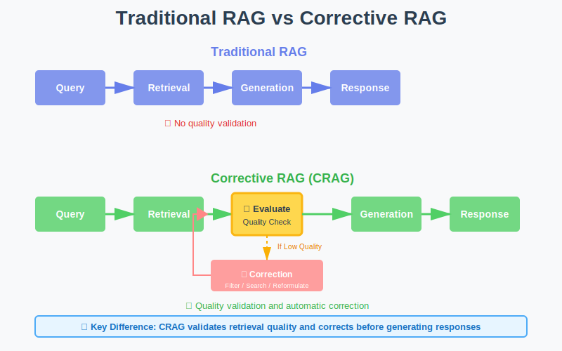
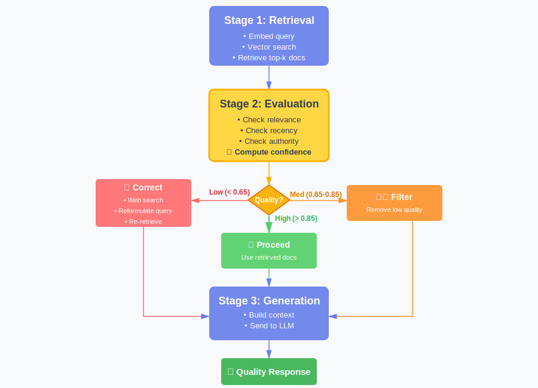
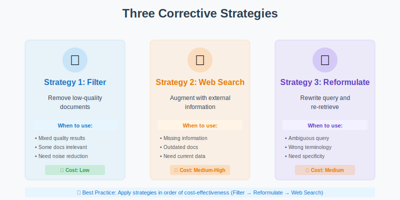
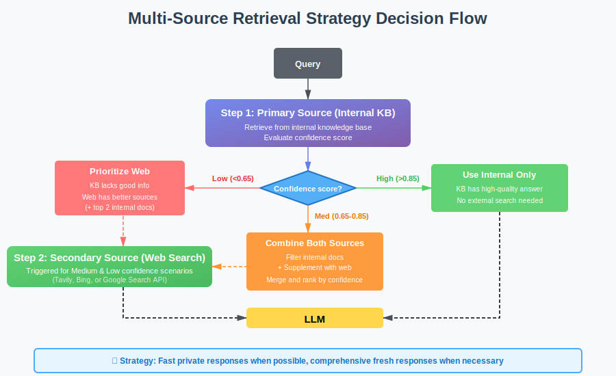
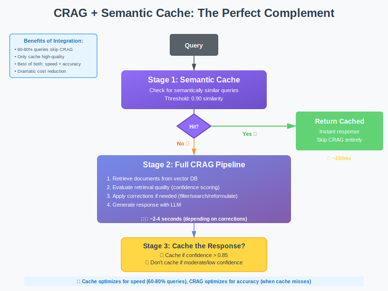
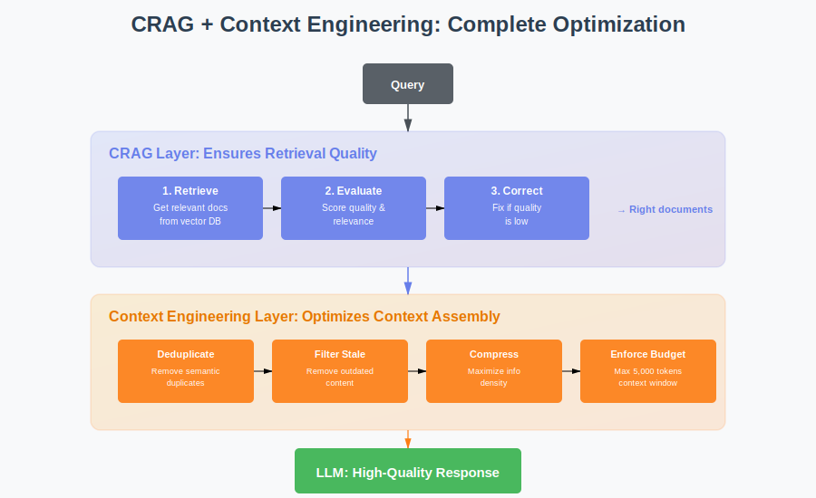

You've mastered [semantic cache](https://www.codebrains.co.in/blog/2025/ai/semantic-cache-smartest-way-to-speed-up-rag "https://www.codebrains.co.in/blog/2025/ai/semantic-cache-smartest-way-to-speed-up-rag") to speed up your RAG system. You've implemented [context engineering](https://www.codebrains.co.in/blog/2025/ai/context-engineering-the-discipline-your-ai-system-desperately-needs "https://www.codebrains.co.in/blog/2025/ai/context-engineering-the-discipline-your-ai-system-desperately-needs") to keep your context lean and relevant. Your retrieval metrics look solid. Your vector search is returning documents with high similarity scores. Your LLM is state-of-the-art.

**But here's the uncomfortable truth: sometimes your retrieval still gets it wrong.**

A user asks "What's the Python SDK installation command for the latest version?" Your vector database returns documentation chunks with 0.89 similarity scores. They look relevant. But when you actually read them, they're about the deprecated Node.js SDK, or they reference version 1.x when you're on version 3.x, or they discuss installation but for a completely different product.

Traditional RAG has no mechanism to detect this failure. It just sends those irrelevant chunks to your LLM and hopes for the best. The LLM tries to make sense of the confusion, produces a vague or incorrect answer, and your user loses trust in your AI.

That's the **retrieval quality problem**, and it's more common than you think. Even with perfect embedding models and optimal chunking strategies, retrieval fails in predictable ways. Documents get outdated. Queries are ambiguous. Similarity scores don't always correlate with actual relevance. Your knowledge base doesn't contain the answer at all.

**What if your RAG system could detect these failures automatically and fix them before generating a response? That's what Corrective RAG (CRAG)** does. It adds a quality control layer between retrieval and generation that evaluates whether your retrieved documents actually answer the question and if they don't, it takes corrective action.

Think of it as having a quality inspector in your RAG pipeline who says "wait, these documents don't actually answer the question" and then either filters out the bad documents, searches for better information, or reformulates the query to get better results.

**CRAG doesn't replace your existing RAG architecture, it enhances**. It's the difference between **blind retrieval** (retrieving documents and assuming they're good) and **intelligent retrieval** (retrieving documents, validating their quality, and correcting course when needed).

## What is Corrective RAG?

Corrective RAG is a retrieval framework that adds a **self-correction mechanism** to traditional RAG systems. Instead of blindly trusting whatever your vector database returns, **CRAG evaluates the quality of retrieved documents** and takes one of three actions: proceed normally if documents are high quality, filter out irrelevant documents if they're mixed quality, or trigger alternative retrieval strategies if they're low quality.

From a technical standpoint, CRAG works by inserting a **retrieval evaluator** between your vector search and your LLM. This evaluator assigns confidence scores to retrieved documents and routes the pipeline based on those scores. It's like adding a circuit breaker to your retrieval system that prevents bad documents from reaching your LLM.



Traditional RAG vs CRAG Pipeline - Side-by-side comparison showing evaluation layer

The key insight behind CRAG is this: **retrieval quality is not binary**. It exists on a spectrum from "perfect match" to "completely irrelevant." Traditional RAG treats everything the same. CRAG adapts its behavior based on where documents fall on that spectrum.

## Why Traditional RAG Fails: The Retrieval Quality Problem

Before we dive into how CRAG works, let's understand why traditional RAG struggles with retrieval quality. The problem isn't that vector search is bad. It's that vector search is incomplete.

### Problem 1: Similarity ≠ Relevance

Your vector database returns documents with high cosine similarity scores. But **similarity measures how close embeddings are in vector space, not whether a document actually answers the question**.

Example: User asks "***How do I increase my API rate limit?***" Your vector search returns a document about "***Understanding API rate limits***" with 0.91 similarity. High score! But the document explains what rate limits are, not how to increase them. **Semantically similar topic, but doesn't answer the question.**

Traditional RAG sends this document to the LLM anyway. The LLM tries to construct an answer from irrelevant context, produces a vague response like "Contact your account manager to discuss rate limit options," and the user is frustrated because they wanted specific steps.

### Problem 2: Ambiguous Queries

Users don't always ask clear, specific questions. They ask ambiguous ones. "How do I reset?" Reset what? Password? API key? Two-factor authentication? Account settings?

Your vector search doesn't know, so it returns documents about all possible interpretations. Half the retrieved chunks are irrelevant to what the user actually meant. Traditional RAG sends all of them to the LLM, creating noise and confusion.

### Problem 3: Missing Information

Sometimes your knowledge base simply doesn't contain the answer. A user asks about a feature released last week. Your documentation hasn't been updated yet. Your vector search returns the closest match it can find, maybe documentation about a related feature.

Traditional RAG presents this as if it's the answer. The LLM, having no way to know the retrieved documents are outdated or irrelevant, generates a confident but incorrect response. Your user tries to follow instructions that don't apply, gets confused, and loses trust.

### Problem 4: Context Conflicts

Your retrieved documents contradict each other. Document A says "use the `--legacy` flag for backward compatibility." Document B says "the `--legacy` flag has been deprecated as of version 3.0."

Both documents have high similarity scores because they're about the same topic. But they provide conflicting information. Traditional RAG sends both to the LLM. The LLM hedges, produces an ambiguous answer, and your user doesn't know which approach to use.

### The Core Limitation

Traditional RAG assumes that if your vector search returns documents, those documents are useful. But that assumption breaks down in production systems where knowledge bases are large, queries are ambiguous, and information changes frequently. **You need a mechanism to validate retrieval quality and correct course when validation fails.**

## How CRAG Actually Works: The Technical Deep Dive

Let's get into the mechanics of Corrective RAG. Understanding the architecture is critical for implementing it correctly in your own systems.

### The Three-Stage Pipeline

CRAG modifies the traditional RAG pipeline by adding an evaluation and correction stage:

**Traditional RAG:**  
Query → Retrieval → Generation → Response

**Corrective RAG:**  
Query → Retrieval → **Evaluation → Correction (if needed)** → Generation → Response



CRAG Three-Stage Pipeline: Detailed flow showing evaluation and correction paths

### Stage 1: Traditional Retrieval

This stage works exactly like traditional RAG. You embed the query and search your vector database for relevant documents.

* Convert the user's query into a vector embedding
* Search your vector database for semantically similar documents
* Retrieve the top-k results (typically 5-10 documents)
* Apply a similarity threshold (e.g., 0.7) to filter out very dissimilar results

Nothing special yet. This is your standard RAG retrieval step.

### Stage 2: Retrieval Evaluation

Here's where CRAG diverges. Before sending documents to the LLM, CRAG evaluates their quality. This evaluation assigns a **confidence score** to each document that indicates how well it answers the query.

* **Relevance scoring:** Assess how well the document content addresses the specific query (not just semantic similarity)
* **Recency checking:** Evaluate how current the document is based on last-updated metadata
* **Authority scoring:** Weight documents based on source quality (official docs vs. forums)
* **Composite confidence:** Combine these signals into a weighted score (e.g., 70% relevance, 20% recency, 10% authority)
* **Aggregate confidence:** Calculate the average confidence across all retrieved documents

The evaluation produces two outputs: per-document confidence scores and an aggregate confidence for the entire retrieval set.

### Stage 3: Corrective Action

Based on evaluation scores, CRAG takes one of three actions:

**Action 1: Proceed (High Confidence)**

If aggregate confidence is high (typically > 0.85), documents are relevant and trustworthy. Proceed with normal RAG generation.

* Documents meet quality thresholds
* Prepare context from retrieved documents as-is
* Send to LLM for generation
* Return response to user

**Action 2: Filter and Refine (Medium Confidence)**

If aggregate confidence is moderate (0.65-0.85), some documents are good, some are noise. Filter out low-confidence documents and proceed with the high-quality subset.

* Keep only documents with confidence scores above threshold (e.g., > 0.7)
* If sufficient high-quality documents remain, prepare context from filtered set
* Send filtered context to LLM for generation
* If all documents filtered out, fall through to correction strategies

**Action 3: Trigger Correction (Low Confidence)**

If aggregate confidence is low (&lt; 0.65), your initial retrieval failed. Trigger corrective measures: web search, knowledge base expansion, or query reformulation.

* Apply one or more correction strategies (web search, query reformulation)
* Retrieve new or supplementary documents
* Prepare context from corrected results
* Send to LLM for generation

## The Three Corrective Strategies

When CRAG detects low-quality retrieval, it can apply three corrective strategies. Each strategy addresses different failure modes.



Three Correction Strategies - Visual breakdown of filter, search, and reformulate

### Strategy 1: Filter Bad Documents

The simplest correction: remove documents that don't meet quality thresholds. This is useful when your retrieval returns a mix of relevant and irrelevant documents.

* **Confidence threshold filtering:** Remove any documents below a minimum confidence score (e.g., 0.7)
* **Semantic deduplication:** Identify and remove documents that say essentially the same thing using embedding similarity
* **Conflict resolution:** When documents contradict each other, keep the more recent or authoritative version
* **Minimum retention:** Always keep at least one document even if all scores are low, to avoid complete failure

Filtering alone often improves response quality significantly by reducing noise. **If you retrieve 10 documents but only 4 are truly relevant, sending just those 4 produces better results than sending all 10.**

### Strategy 2: Web Search Augmentation

When your knowledge base doesn't contain the answer, search the web for current information. This is particularly useful for time-sensitive queries or topics outside your knowledge base.

* **Trigger web search:** Use a search API (like Tavily, Bing, or Google) to find relevant web pages
* **Content extraction:** Pull main content from search results, removing navigation, ads, and boilerplate
* **Chunking and ranking:** Break extracted content into chunks and score them for relevance
* **Source merging:** Combine web documents with your filtered internal documents, with configurable priority (web-first for freshness, or internal-first for authority)
* **Metadata tracking:** Tag web sources clearly so responses can cite external sources appropriately

This is where CRAG gets powerful. **Your system automatically realizes "I don't have good information about this" and goes looking for better sources. No human intervention required.**

### Strategy 3: Query Reformulation

Sometimes the query itself is the problem. It's too vague, uses unexpected terminology, or is ambiguous. Reformulate the query and re-retrieve.

* **Use LLM for reformulation:** Ask the LLM to rewrite the query to be more specific, adding context from failed retrieval attempts
* **Generate query variations:** Create multiple reformulated versions that clarify ambiguities or expand abbreviations
* **Re-embed and search:** Convert the reformulated query into embeddings and search the vector database again
* **Evaluate new results:** Score the new retrieval to see if quality improved
* **Escalation strategy:** If reformulation doesn't help (confidence still low), escalate to web search as a fallback

Query reformulation is subtle but effective. A user asks "How do I set this up?" The system reformulates to "How do I set up [product name] authentication?" and suddenly retrieval works because the query is specific.

## Evaluating Retrieval Quality: The Heart of CRAG

The effectiveness of CRAG depends entirely on your retrieval evaluator. **If your evaluator is accurate, CRAG catches bad retrievals and fixes them. If your evaluator is inaccurate, CRAG makes things worse** by filtering good documents or unnecessarily triggering corrections.

Let's explore how to build an effective evaluator.

### Evaluation Signal 1: Semantic Relevance

Does the document content actually address the query? This goes beyond vector similarity. You need to assess whether the document contains information that helps answer the specific question asked.

```
def compute_relevance(query, document):
    # Use a cross-encoder model for precise relevance scoring
    # Cross-encoders jointly encode query and document
    relevance_score = cross_encoder.predict(query, document.text)
    
    # Alternatively, use LLM-as-judge
    # prompt = f"Does this document answer the query?\nQuery: &#123;query&#125;\nDocument: &#123;document.text&#125;\nAnswer (yes/no):"
    # judgment = llm.generate(prompt)
    # relevance_score = 1.0 if 'yes' in judgment.lower() else 0.0
    
    return relevance_score
```

Cross-encoder models are particularly effective for this task. Unlike bi-encoders (used in vector search), cross-encoders see both query and document together and can assess relevance more accurately. The trade-off is speed: cross-encoders are slower, but that's acceptable for a quality check after retrieval.

### Evaluation Signal 2: Temporal Freshness

Is the document current, or is it outdated? This matters enormously for technical documentation, product features, and policy information.

```
def compute_recency(document):
    # Check document metadata
    last_updated = document.metadata.get('last_updated')
    
    if not last_updated:
        return 0.5  # Unknown age - moderate penalty
    
    # Calculate age in days
    age_days = (datetime.now() - last_updated).days
    
    # Decay function - fresher is better
    if age_days &lt; 30:
        return 1.0  # Very fresh
    elif age_days &lt; 90:
        return 0.8  # Recent
    elif age_days &lt; 180:
        return 0.6  # Moderately old
    elif age_days &lt; 365:
        return 0.4  # Old
    else:
        return 0.2  # Very old
```

Temporal freshness prevents CRAG from confidently using outdated information. A document last updated three years ago gets penalized, triggering correction strategies that might find more current information.

### Evaluation Signal 3: Source Authority

Is this document from an authoritative source? Official documentation is more trustworthy than community forum posts. Product specifications are more reliable than marketing blog posts.

```
def compute_authority(document):
    source_type = document.metadata.get('source_type')
    
    authority_scores = &#123;
        'official_docs': 1.0,
        'api_reference': 1.0,
        'internal_kb': 0.9,
        'verified_blog': 0.7,
        'community_forum': 0.5,
        'external_blog': 0.4,
        'unknown': 0.3,
    &#125;
    
    return authority_scores.get(source_type, 0.3)
```

Authority scoring helps CRAG prefer high-quality sources and deprioritize or filter out unreliable ones.

### Evaluation Signal 4: Content Completeness

Does the document provide a complete answer, or just a partial one? This is harder to assess programmatically but critical for quality.

This LLM-as-judge approach adds cost but significantly improves evaluation accuracy. For production systems, consider caching completeness scores for documents to amortize the cost.

### Combining Signals: The Composite Score

Combine multiple signals into a single confidence score:

```
def compute_confidence(query, document):
    relevance = compute_relevance(query, document)
    recency = compute_recency(document)
    authority = compute_authority(document)
    completeness = compute_completeness(query, document)
    
    # Weighted combination
    confidence = (
        relevance * 0.50 +      # Most important
        completeness * 0.25 +   # Second most important
        recency * 0.15 +        # Context-dependent importance
        authority * 0.10        # Tiebreaker
    )
    
    return confidence
```

Adjust weights based on your domain. For rapidly changing products, increase recency weight. For stable reference material, increase authority weight.

## CRAG in Action: A Real-World Example

Let's walk through a concrete example to see how CRAG handles a challenging query.

**Scenario: Enterprise API Documentation Chatbot**

User asks: "What's the rate limit for the new GraphQL endpoint?"

### Step 1: Initial Retrieval

```
# Traditional RAG retrieves these documents:
    documents = [
        &#123;
            'text': 'Our REST API has a rate limit of 100 requests per minute...',
            'similarity': 0.87,
            'last_updated': '2023-06-15'
        &#125;,
        &#123;
            'text': 'GraphQL queries allow you to request exactly the data you need...',
            'similarity': 0.84,
            'last_updated': '2024-11-01'
        &#125;,
        &#123;
            'text': 'Rate limiting is enforced based on your API key tier...',
            'similarity': 0.82,
            'last_updated': '2024-08-20'
        &#125;
    ]
```

Traditional RAG would send all three documents to the LLM. But look closely: none of them actually answer the question about GraphQL endpoint rate limits specifically.

### Step 2: Quality Evaluation

```
# CRAG evaluates each document
    scores = [
        &#123;
            'doc': documents[0],
            'relevance': 0.6,  # About rate limits, but REST not GraphQL
            'recency': 0.3,    # 18 months old
            'authority': 1.0,  # Official docs
            'completeness': 0.4,  # Doesn't answer GraphQL question
            'confidence': 0.52
        &#125;,
        &#123;
            'doc': documents[1],
            'relevance': 0.5,  # About GraphQL, but not rate limits
            'recency': 0.95,   # Very recent
            'authority': 1.0,  # Official docs
            'completeness': 0.2,  # Doesn't mention limits
            'confidence': 0.48
        &#125;,
        &#123;
            'doc': documents[2],
            'relevance': 0.7,  # About rate limiting in general
            'recency': 0.75,   # Recent enough
            'authority': 1.0,  # Official docs
            'completeness': 0.3,  # Generic, not specific to GraphQL
            'confidence': 0.59
        &#125;
    ]

    avg_confidence = 0.53  # Low!
```

CRAG detects that average confidence is low (0.53 &lt; 0.65). **The retrieved documents are topically related but don't actually answer the specific question.**

### Step 3: Corrective Action

CRAG triggers correction. First, it tries query reformulation:

```
# Reformulate the query
    reformulated = "GraphQL API endpoint rate limit requests per minute"

    # Re-retrieve
    new_documents = vector_db.search(embed(reformulated), top_k=5)

    # Still low confidence?
    # Escalate to web search
    web_results = web_search("GraphQL endpoint rate limit [company] API")

    # Extract relevant content from official blog or changelog
    web_doc = &#123;
        'text': 'Our new GraphQL endpoint (beta) has a rate limit of 200 requests per minute for Pro accounts...',
        'source': 'company_blog',
        'date': '2024-11-05',
        'url': 'https://company.com/blog/graphql-beta'
    &#125;

    # Evaluate web result
    web_confidence = evaluate(query, web_doc) # 0.89 - High!

    # Use web result as primary source
    final_documents = [web_doc] + filter_low_confidence(new_documents)
```

### Step 4: Generation with Corrected Context

```
context = prepare_context(final_documents)
    response = llm.generate(query, context)

    # Response: "The GraphQL endpoint (currently in beta) has a rate limit 
    # of 200 requests per minute for Pro accounts. This was recently announced 
    # in our November 5th blog post. Note that this is higher than our REST 
    # API limit of 100 requests per minute."
```

CRAG automatically detected that the knowledge base didn't have the answer, searched the web for current information, found the relevant blog post, and produced an accurate response with proper attribution. **Traditional RAG would have cobbled together a vague answer from the irrelevant documents.**

## Multi-Source Retrieval: Combining Knowledge Bases and Web Search

One of CRAG's most powerful patterns is intelligent multi-source retrieval. Your internal knowledge base is your primary source, but when it fails, CRAG can seamlessly fall back to external sources.

### The Multi-Source Strategy



This strategy gives you the best of both worlds: **fast, private responses from your knowledge base when possible, and fresh, comprehensive responses from the web when necessary**.

### When to Use Multi-Source CRAG

Multi-source CRAG shines in specific scenarios:

**Scenario 1: Enterprise Search with Public Context**

Your company's internal documentation is authoritative for your products, but users also need context from industry standards, competitor analysis, or general best practices. CRAG retrieves from internal docs first, then supplements with curated web sources when needed.

**Scenario 2: Research Assistants**

Academic or market research tools need both proprietary research databases and current public information. CRAG ensures you're not missing recent developments by automatically checking web sources when your database lacks information.

**Scenario 3: Customer Support with Product Updates**

Your documentation might lag behind rapid product releases. CRAG can detect when documentation is outdated and supplement with recent release notes, blog announcements, or community discussions.

### Implementation Considerations

When implementing multi-source CRAG, consider:

**Source Priority:** Define clear priority rules. Internal documents might be more authoritative, but web sources might be fresher. Your evaluation function should weight these factors appropriately.

**Cost Management:** Web search APIs have costs. Don't trigger web search for every query. Use it as a fallback when internal retrieval confidence is low.

**Attribution:** Always cite sources clearly. Users need to know whether information came from official docs or external sources.

**Security:** Be careful about what queries you send to external search APIs. Sanitize them to avoid leaking sensitive information.

## Common Pitfalls: Where CRAG Goes Wrong

CRAG is powerful, but it's easy to implement incorrectly. Here are the mistakes I see teams make repeatedly.

### Pitfall 1: Over-Sensitive Evaluation

**The Problem:** Your evaluator is too strict. It assigns low confidence to perfectly good documents, triggering unnecessary corrections.

**The Result:** You're constantly hitting web search APIs or reformulating queries even when your initial retrieval was fine. Latency spikes. Costs explode. Users wait longer for answers that aren't meaningfully better.

**The Solution:** Tune your confidence thresholds carefully. Start conservative (0.75 threshold) and gradually tighten. Monitor false negatives: how often does CRAG trigger corrections when the original documents were actually fine?

### Pitfall 2: Under-Sensitive Evaluation

**The Problem:** Your evaluator is too lenient. It assigns high confidence to mediocre documents, and CRAG proceeds with bad context.

**The Result:** CRAG adds overhead (evaluation cost) without benefits. You're essentially running traditional RAG with extra steps.

**The Solution:** Monitor false positives: how often does CRAG proceed with high confidence but produce wrong answers? Tighten thresholds and add more evaluation signals.

### Pitfall 3: Ignoring Domain Context

**The Problem:** You use the same CRAG configuration for all queries, ignoring that different domains need different correction strategies.

**The Example:** For "What's the capital of France?" you don't need web search. Your knowledge base has this. But for "What's the weather in Paris today?" you absolutely need web search.

**The Solution:** Implement query-type routing.

### Pitfall 4: Poor Web Search Integration

**The Problem:** You trigger web search but don't properly extract, filter, or rank web results. Web pages are noisy: headers, footers, navigation, ads. **Sending raw HTML to your LLM creates garbage context.**

**The Solution:** Invest in robust web content extraction.

### Pitfall 5: No Correction Strategy Ordering

**The Problem:** You apply all corrections simultaneously or in random order, wasting resources and time.

**The Solution:** Apply corrections in order of cost-effectiveness.

This cascading approach minimizes latency and cost while maximizing correction success rate.

## Integrating CRAG with Semantic Cache and Context Engineering

CRAG doesn't exist in isolation. It's part of a larger intelligent RAG architecture. Let's see how it integrates with the techniques we've discussed previously.

### CRAG + Semantic Cache

Semantic cache and CRAG are perfect complements. Here's how they work together:



Key insight: **only cache high-confidence CRAG responses**. If CRAG had to apply corrections and still ended up with moderate confidence, don't cache. You don't want to serve potentially incorrect cached responses.

### CRAG + Context Engineering

CRAG is essentially a form of context engineering: it's about ensuring the context you send to your LLM is high quality. The techniques integrate naturally:

**CRAG handles retrieval quality.** It ensures you retrieve the right documents.

**Context engineering handles context optimization.** It ensures you assemble and format those documents efficiently.



Together, CRAG and context engineering create a system that **retrieves the right information and presents it optimally**. CRAG prevents garbage in. Context engineering maximizes signal-to-noise ratio. The LLM gets the best possible foundation for generation.

## When to Use CRAG vs Traditional RAG

CRAG isn't always necessary. Sometimes traditional RAG is sufficient. Here's how to decide:

### Use Traditional RAG When:

* **Your knowledge base is stable and comprehensive.** If you have complete documentation that rarely changes, retrieval quality is naturally high. CRAG adds overhead without benefits.
* **Queries are simple and well-scoped.** "What's your return policy?" has a clear answer in your docs. Traditional RAG handles this fine.
* **Latency is critical and accuracy is acceptable.** If you need sub-second responses and 80% accuracy is good enough, skip CRAG evaluation overhead.
* **You're in a controlled domain.** Internal tools with trained users who ask predictable questions don't need correction mechanisms.

### Use CRAG When:

* **Your knowledge base has gaps.** If users frequently ask about topics you don't have documentation for, CRAG's web search augmentation is invaluable.
* **Information changes rapidly.** Product updates, policy changes, or breaking news mean your knowledge base is often outdated. CRAG detects staleness and corrects.
* **Queries are complex or ambiguous.** When users ask vague questions or queries that require synthesis across multiple sources, CRAG's correction loop helps.
* **Accuracy is critical.** Customer support, medical information, legal guidance, financial advice all require high accuracy. CRAG's validation prevents confidently wrong answers.
* **You're integrating multiple data sources.** When combining internal docs, web sources, and real-time data, CRAG's quality evaluation ensures you prioritize the right sources.

### The Hybrid Approach

In production, many teams use a hybrid approach: traditional RAG for straightforward queries, CRAG for complex ones.

* **Assess query complexity:** Use a classifier to determine if a query is simple, medium, or complex based on length, ambiguity, specificity, and domain
* **Simple queries (fast path):** Use traditional RAG with no evaluation overhead - just retrieve and generate (estimated 40-50% of queries)
* **Medium queries (filter path):** Apply CRAG evaluation and filtering only, skip expensive corrections unless confidence is very low (estimated 30-40% of queries)
* **Complex queries (full CRAG):** Use complete CRAG pipeline with all correction strategies available - reformulation, web search, iteration loops (estimated 10-20% of queries)
* **Dynamic threshold adjustment:** Lower confidence thresholds for simple queries (0.80), higher for complex ones (0.90)

This gives you the best of both worlds: **fast responses for simple queries, thorough correction for complex ones**.

## Implementation Guide: Building Your First CRAG System

Let's walk through implementing a basic CRAG system from scratch. We'll build incrementally, starting with evaluation and adding correction strategies.

### Step 1: Set Up Baseline RAG

Start with traditional RAG working correctly:

* Query embedding using your chosen model (e.g., OpenAI's text-embedding-3-small)
* Vector database search returning top-k similar documents
* Context preparation from retrieved documents
* LLM generation with the assembled context
* Basic error handling and response formatting

### Step 2: Add Retrieval Evaluation

Implement a simple evaluator using an LLM as judge:

* **Create evaluation prompts:** Ask the LLM to score document relevance on a 0.0-1.0 scale
* **Key evaluation criteria:** Does the document contain information that directly answers the query? Is it current and accurate? Is it complete?
* **Use a cheaper model:** GPT-4o-mini or similar for cost-effective evaluation
* **Set temperature to 0:** Ensure consistent, deterministic scoring
* **Parse scores safely:** Handle cases where LLM output isn't a clean number, default to moderate confidence (0.5)
* **Calculate aggregate:** Average individual document scores to get overall retrieval confidence

### Step 3: Implement Filter Correction

Add filtering for low-quality documents:

* Set a confidence threshold (start with 0.6)
* Filter out documents below the threshold
* Keep at least one document even if all scores are low (prevents complete failure)
* Return filtered set for context preparation

### Step 4: Add Web Search Correction

Integrate web search for missing information:

* **Choose a search API:** Tavily, Bing, or Google Custom Search
* **Trigger conditions:** Only search when confidence is below threshold (e.g., 0.65)
* **Extract content:** Pull main text from search results, remove HTML boilerplate
* **Format as documents:** Structure web results with URL, content, and source metadata
* **Merge strategies:** Combine web results with filtered internal documents (configurable priority)

### Step 5: Combine into CRAG Pipeline

Bring it all together:

* **Stage 1 - Retrieve:** Get documents from vector database
* **Stage 2 - Evaluate:** Score each document and calculate aggregate confidence
* **Stage 3 - Route:** Based on confidence, choose action (proceed / filter / correct)
* **High confidence (>0.85):** Use retrieved docs as-is
* **Medium confidence (0.65-0.85):** Apply filtering
* **Low confidence (&lt;0.65):** Trigger web search
* **Stage 4 - Generate:** Send final context to LLM
* **Add logging:** Track which path was taken, confidence scores, and correction triggers

This is a minimal but functional CRAG system. **You can now test it, measure improvements, and iterate.**

## Key Takeaways: What You Need to Remember

Here's what matters about Corrective RAG:

* **Retrieval quality isn't binary:** Documents exist on a spectrum from perfect to irrelevant. CRAG adapts behavior based on that spectrum instead of blindly trusting vector similarity.
* **Evaluation is everything:** CRAG's effectiveness depends entirely on accurate retrieval evaluation. Invest in robust evaluators that combine multiple signals: relevance, recency, authority, completeness.
* **Correction strategies cascade:** Apply cheap corrections first (filtering), then moderate ones (reformulation), then expensive ones (web search). This minimizes latency and cost.
* **Multi-source retrieval unlocks power:** Combining private knowledge bases with public web search gives you comprehensive coverage without maintaining encyclopedic internal docs.
* **CRAG complements other techniques:** It works beautifully with semantic cache (only cache high-confidence responses) and context engineering (optimize the context you ultimately send).
* **Not every query needs correction:** 60-80% of queries have high-confidence retrieval and skip correction entirely. CRAG adds minimal overhead for these common cases.
* **Measure everything:** Track correction trigger rates, success rates, accuracy improvements, and latency distributions. Data-driven tuning is essential.
* **Start simple, add sophistication:** Begin with basic evaluation and filtering. Add web search and reformulation after you've validated the core concept.

## What's Next: The RAG Playbook

You now understand **how Corrective RAG strengthens your RAG pipeline spotting bad retrievals, evaluating document quality, and auto-correcting context before it reaches your LLM.**

But that naturally leads to the next question: **is fixing retrieval mistakes enough?**

CRAG is powerful, but it’s still just one strategy in a much larger retrieval ecosystem. Modern RAG uses many patterns hybrid search, rerankers, query expansion, agentic retrieval, graph-augmented flows each with its own accuracy, latency, and cost trade-offs.

So the next step is to zoom out and understand the full landscape.

In our next blog, **The RAG Playbook**, we’ll map every important retrieval strategy, explain when each one shines, and show you how to choose the right approach for your use case whether you’re building support bots, research assistants, code copilots, or enterprise knowledge systems.

What's your experience with retrieval quality in production RAG systems? Have you implemented any correction mechanisms? Are you dealing with knowledge base gaps or outdated information? I'd love to hear about your challenges and approaches. Connect with me on [LinkedIn](https://www.linkedin.com/in/ankitgubrani/ "https://www.linkedin.com/in/ankitgubrani/").