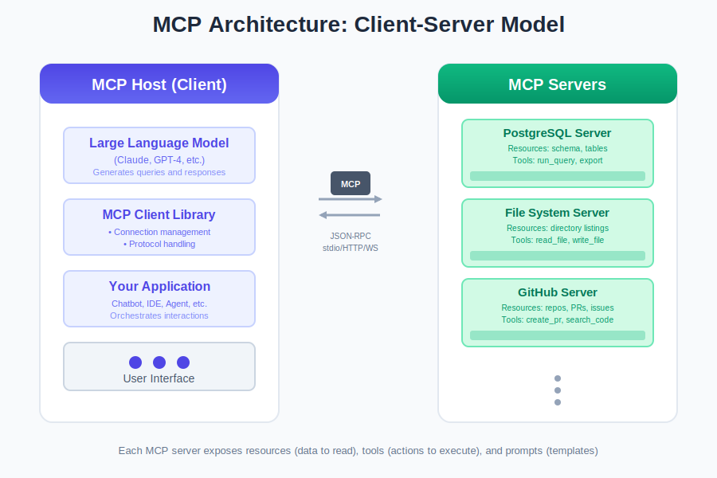
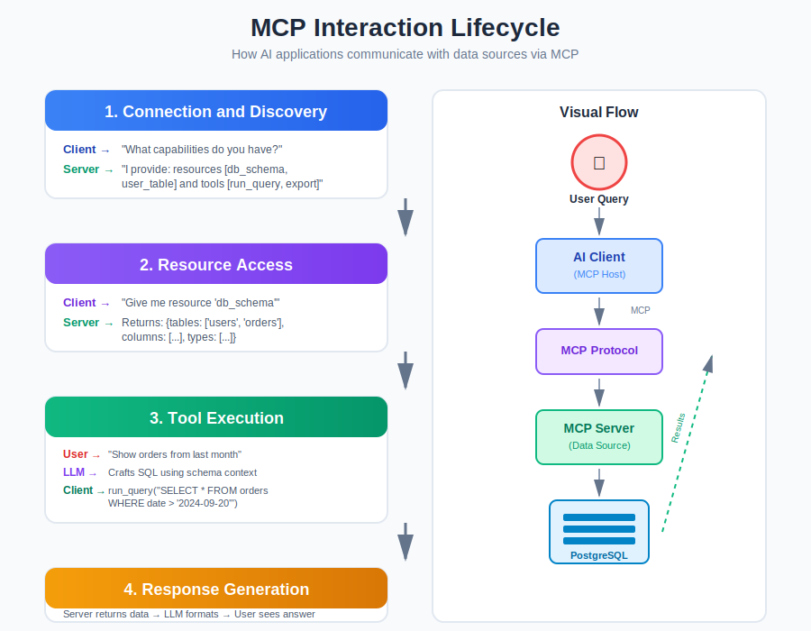

You've built your RAG system following [our guide to RAG fundamentals](https://www.codebrains.co.in/blog/2025/ai/what-is-rag-retrieval-augmented-generation-guide "https://www.codebrains.co.in/blog/2025/ai/what-is-rag-retrieval-augmented-generation-guide"). You understand [when to use RAG vs CAG vs KAG](https://www.codebrains.co.in/blog/2025/ai/rag-vs-cag-vs-kag-choosing-right-augmentation-strategy "https://www.codebrains.co.in/blog/2025/ai/rag-vs-cag-vs-kag-choosing-right-augmentation-strategy"). You've set up your [vector database](https://www.codebrains.co.in/blog/2025/ai/vector-databases-search-engine-rag-system-actually-needs "https://www.codebrains.co.in/blog/2025/ai/vector-databases-search-engine-rag-system-actually-needs") and your retrieval pipeline is humming along nicely. But then you need to connect your AI to another data source. And another. And another.

Suddenly, you're writing custom integrations for everything: your database, your file system, your API endpoints, your internal tools. Each integration requires different authentication, different data formats, different error handling. **Before you know it, 60% of your codebase is just glue code** connecting your AI to various data sources.

Here's the uncomfortable truth: **building AI applications shouldn't require reinventing data integration every single time.** We need a standard. That's exactly what the Model Context Protocol (MCP) aims to solve.

## What is the Model Context Protocol?

The Model Context Protocol is an open standard developed by Anthropic that defines how AI models should communicate with external data sources and tools. **Think of it as USB-C for AI integrations.** Just like USB-C eliminated the mess of different charging cables, MCP eliminates the mess of custom AI integrations.

From a technical standpoint, MCP is a client-server protocol that provides a standardized way for AI applications to:

* Connect to data sources (databases, file systems, APIs)
* Execute tools and functions
* Access contextual information
* Handle authentication and permissions

The protocol is **transport-agnostic** (works over stdio, HTTP, WebSocket) and **language-agnostic** (implementations exist for Python, TypeScript, and more). This means you can write an MCP server once, and any MCP-compatible AI application can use it immediately.

## Why MCP Changes Everything for AI Applications

Before MCP, every AI application needed custom code to connect to data sources. Let's say you wanted your AI assistant to access your company's PostgreSQL database, Notion workspace, GitHub repositories, and Google Drive. You'd write four separate integrations, each with its own authentication logic, error handling, and data transformation code.

With MCP, you write one MCP server for each data source. Now any MCP-compatible AI application can access all four sources without custom integration work. Here's what this solves:

### The Integration Explosion Problem

**Without MCP:** N AI applications × M data sources = N×M custom integrations  
**With MCP:** N AI applications + M MCP servers = N+M total components

Let's make this concrete. You have 5 AI tools (chatbot, code assistant, documentation generator, data analyst, customer support) and 10 data sources (PostgreSQL, S3, Slack, Notion, GitHub, Google Drive, Stripe, Salesforce, internal APIs, file system).

* **Without MCP: 5 × 10 = 50 custom integrations** to build and maintain
* **With MCP: 5 + 10 = 15 components** (5 clients + 10 servers)

**That's a 70% reduction in integration complexity.** And every new AI tool you add? It gets access to all 10 data sources immediately.

### The Real-World Impact

For teams building AI applications, this means:

* **Faster development:** Stop writing boilerplate integration code
* **Better security:** Centralized authentication and permission management
* **Easier maintenance:** Update a data source integration once, all AI tools benefit
* **True composability:** Mix and match data sources without code changes

## How MCP Works: The Architecture Breakdown

MCP follows a client-server architecture that should feel familiar if you've worked with APIs. Let's break down the core components and how they interact.

### The Core Components

**MCP Hosts (Clients)**  
These are your AI applications: Claude Desktop, custom chatbots, AI agents, workflow automation tools. The host manages the connection to MCP servers and coordinates between the LLM and available resources.

**MCP Servers**  
These are your data sources and tools exposed via the MCP protocol. Each server provides **resources** (data to read), **prompts** (templated interactions), or **tools** (functions to execute). A server might be as simple as "read local files" or as complex as "query and manipulate a PostgreSQL database."

**The Protocol Layer**  
MCP defines standard message types for discovery, authentication, and data exchange. When a client connects to a server, it first asks "what can you do?" The server responds with its capabilities, then the client can request specific resources or tool executions.



### The MCP Lifecycle

Let's walk through what happens when an AI application uses MCP:

**1. Connection & Discovery**

```
Client: "Hello MCP server, what capabilities do you have?"
        Server: "I can provide these resources: [database_schema, user_table, orders_table]
                I can execute these tools: [run_sql_query, export_to_csv]"
```

**2. Resource Access**

```
Client: "Give me the resource 'database_schema'"
        Server: "Here's the schema: [detailed structure]"
        LLM: *uses schema to understand available data*
```

**3. Tool Execution**

```
User: "Show me all orders from last month"
        LLM: *crafts SQL query based on schema*
        Client: "Execute tool 'run_sql_query' with: SELECT * FROM orders WHERE date > '2024-09-20'"
        Server: *executes query safely*
        Server: "Here are the results: [data]"
        LLM: *formats results for user*
```

**4. Context Updates**  
Throughout the conversation, the MCP server can provide updated context, refresh credentials, or signal when data has changed. This keeps the AI's understanding of the data source current.



## MCP in Action: Real-World Use Cases

Let's explore concrete scenarios where MCP fundamentally improves how we build AI applications.

### Use Case 1: Multi-Source Code Assistant

**The Challenge:** You're building an AI code assistant that needs to access your codebase, pull request history, documentation, and internal wiki. Without MCP, you'd write separate integrations for GitHub, GitLab, Confluence, and your file system.

**With MCP:**

```
MCP Servers:
        - GitHub MCP Server (pull requests, issues, code)
        - File System MCP Server (local codebase)
        - Confluence MCP Server (documentation)

        Your AI assistant connects to all three instantly.
```

When a developer asks "Why did we implement authentication this way?" the assistant:

1. Searches local files for auth implementation
2. Queries GitHub for related pull requests
3. Retrieves architecture decisions from Confluence
4. Synthesizes a complete answer with full context

**All without you writing a single line of integration code.**

### Use Case 2: Customer Support with Full Context

**The Challenge:** Your support AI needs access to customer data (Stripe), communication history (Intercom), product usage (internal API), and documentation (Notion). Each source requires authentication, rate limiting, and data transformation.

**With MCP:**

```
MCP Servers:
        - Stripe MCP Server (subscription, payment history)
        - Intercom MCP Server (previous conversations)
        - Product Analytics MCP Server (usage data)
        - Notion MCP Server (help articles)

        Your support AI sees a unified view of the customer.
```

When a customer asks "Why was I charged twice?" the AI:

1. Fetches payment history from Stripe
2. Retrieves previous support conversations from Intercom
3. Checks product usage for failed transactions
4. References billing documentation from Notion
5. Provides an informed, contextual response

The support agent gets a complete picture, and you maintain each data source integration independently.

### Use Case 3: RAG System That Actually Scales

Remember our discussion about [vector databases](https://www.codebrains.co.in/blog/2025/ai/vector-databases-search-engine-rag-system-actually-needs "https://www.codebrains.co.in/blog/2025/ai/vector-databases-search-engine-rag-system-actually-needs")? MCP makes RAG systems more maintainable and extensible.

**Without MCP:** Your RAG pipeline has hard-coded connections to your vector database, document processor, and metadata store. Want to add a new source? Modify the core pipeline.

**With MCP:** Each component is an MCP server:

```
- Pinecone MCP Server (vector search)
        - S3 MCP Server (document storage)
        - PostgreSQL MCP Server (metadata)
        - Notion MCP Server (live documentation)
```

Your RAG orchestrator treats them all uniformly. **Adding a new data source? Just point to another MCP server. The pipeline doesn't change.**

This is particularly powerful when you need different augmentation strategies. Your system can dynamically choose between [RAG, CAG, or KAG](https://www.codebrains.co.in/blog/2025/ai/rag-vs-cag-vs-kag-choosing-right-augmentation-strategy "https://www.codebrains.co.in/blog/2025/ai/rag-vs-cag-vs-kag-choosing-right-augmentation-strategy") based on query type, and **MCP ensures you can access any required data source seamlessly.**

## The MCP Ecosystem: Real Teams, Real Integrations

MCP is new, but teams are already shipping production systems with it. Here's what the early adopters are building:

### The Code Review AI

**Connected MCP servers:** GitHub, Confluence, Slack, internal style guide API

**What it does:** Reviews pull requests with full context of past decisions, coding standards, and team discussions. They built the style guide MCP server custom, everything else was community-built.

### The Customer Success Copilot

**Connected MCP servers:** Salesforce, Intercom, PostgreSQL, product analytics, Notion

**What it does:** Support agents get instant context on customer health, past tickets, product usage, and internal documentation. Five data sources, zero custom integration code.

### The Design System Assistant

**Connected MCP servers:** Figma, GitHub, Storybook, internal component registry

**What it does:** Answers questions about design components, generates code that matches existing patterns, checks for design inconsistencies. The Figma MCP server was built by the community, they just plugged it in.

### What's Actually Available

The pattern here? **Most teams are using 70-80% community-built MCP servers and building 20-30% custom ones for their internal systems.** The ecosystem has critical mass for the categories that matter:

**Developer Tools:** GitHub, GitLab, Docker : your entire development workflow  
**Databases & Storage:** PostgreSQL, MongoDB, Redis, S3 : if it stores data, there's probably a server for it  
**Business Tools:** Slack, Notion, Google Workspace, Salesforce : the tools your team already uses  
**Design & Creative:** Figma, design systems, asset libraries : yes, your AI can understand design context  
**Cloud Platforms:** AWS, GCP, Azure services : enterprise-grade integrations

### The Server You Need Probably Exists

Before building, search the MCP GitHub org, check community forums, and browse npm/PyPI for "mcp-server" packages. The ecosystem is decentralized but discoverable. And when you do build something custom? Consider sharing it, the next team might be looking for exactly what you built.

The real power isn't in any single MCP server. It's in the combination. That code review AI? It wouldn't be possible without connecting four different data sources seamlessly. That's the promise of MCP: **composable integrations that actually work.**

## MCP vs Traditional Integration Approaches

Let's be clear about what MCP is and isn't. **It's not replacing APIs. It's not a new database protocol. It's a standardized layer for AI-data interactions.** Here's how it compares to other approaches:

### MCP vs Custom REST APIs

**REST API:**

* Designed for general-purpose access
* Requires client-side code for every AI application
* No standard for describing capabilities to AI

**MCP:**

* **Designed specifically for AI consumption**
* **Self-describing capabilities**
* Built-in support for resources, tools, and prompts
* Client code writes itself (via MCP SDKs)

### MCP vs Direct Database Access

**Direct Access:**

* AI application connects directly to your database
* **Security risk: LLM could execute any query**
* No abstraction or safety layer

**MCP:**

* **Controlled access through defined tools**
* Can implement query validation, rate limiting, row-level security
* Audit trail of AI interactions

### MCP vs Traditional Integration Platforms (Zapier, n8n)

**Integration Platforms:**

* Built for workflow automation, not AI consumption
* Focus on connecting apps to apps
* Pre-built workflows, not dynamic AI interactions

**MCP:**

* **Built for AI applications**
* Enables dynamic, context-aware interactions
* AI decides what data to access based on conversation

## Common Pitfalls and Best Practices

### Pitfall 1: Exposing Too Much in One MCP Server

**Problem:** Creating a monolithic MCP server that exposes your entire infrastructure.

**Solution:** Follow the principle of least privilege. Create focused MCP servers:

* One for customer data
* One for product analytics
* One for internal documentation

This improves security and makes servers more maintainable. Each server can have its own access controls and audit logging.

### Pitfall 2: Not Validating Tool Inputs

**Problem:** Trusting LLM-generated inputs without validation.

**Solution:** Always validate and sanitize inputs in your MCP server:

Remember: **the LLM is making tool calls on behalf of users. Treat MCP tools like you'd treat any external API: validate everything.**

### Pitfall 3: Ignoring Connection Management

**Problem:** Opening new connections for every request, leading to connection pool exhaustion.

**Solution:** Implement proper connection pooling and lifecycle management:

MCP servers are long-running processes. **Manage resources accordingly.**

### Best Practice: Progressive Disclosure of Capabilities

Don't expose all your data sources immediately. **Start with read-only access to a subset of data.** As you gain confidence, expand:

1. Phase 1: Read-only access to non-sensitive tables
2. Phase 2: Read access to more data with row-level filtering
3. Phase 3: Controlled write operations with approval workflows

This reduces risk and lets you learn how the AI uses your data before granting broader access.

## Key Takeaways: Why MCP Matters

Here's what you need to remember about the Model Context Protocol:

* **MCP is about standardization:** It eliminates the need to write custom integration code for every AI application and data source combination.
* **Think in components:** Build MCP servers for your data sources once, use them across all your AI applications.
* **Security by design:** MCP servers provide a controlled access layer, preventing direct LLM access to sensitive systems.
* **Start simple:** You don't need to integrate everything at once. Start with one MCP server for your most-accessed data source and expand from there.
* **MCP complements RAG:** MCP handles the "how do I connect" problem, while RAG/CAG/KAG handle the "what do I retrieve" problem. They work together.
* **The ecosystem is growing:** More data sources, more tools, more AI applications will support MCP. Early adoption gives you a head start.

## What's Next

You now understand how MCP standardizes AI-data integration, eliminating the need to build custom connections for every data source. But here's a critical question most teams overlook:  **do you keep your AI's context fresh over time?** That's where context rot becomes a problem.

**Context rot** happens when your AI's understanding gradually becomes stale. Vector embeddings created months ago, cached responses referencing deprecated features, knowledge graphs with broken relationships. We'll tackle that challenge in the next post.

In the meantime, here's your action item: **Look at your current AI system (or the one you're planning).**

* How many custom integrations are you maintaining? (MCP opportunity)
* Are you duplicating integration code across multiple AI tools? (MCP opportunity)
* Do you need your AI to access multiple data sources dynamically? (Perfect for MCP)

**MCP isn't about following trends. It's about reducing integration complexity and building composable AI systems that scale.**

What's your experience with AI integrations? Are you dealing with integration sprawl, or are you just starting to build? I'd love to hear about your challenges and use cases s
connect with me on [LinkedIn](https://www.linkedin.com/in/ankitgubrani/ "https://www.linkedin.com/in/ankitgubrani/")