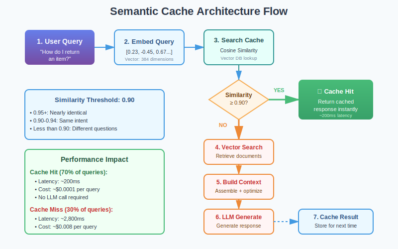
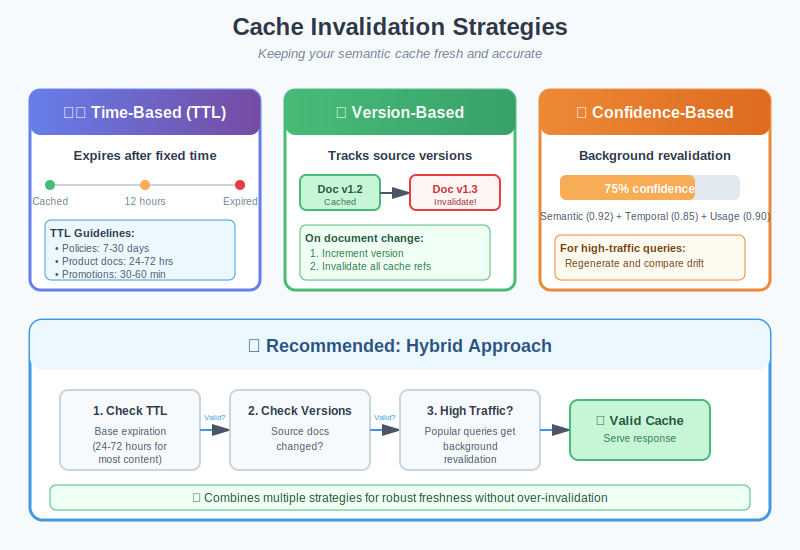
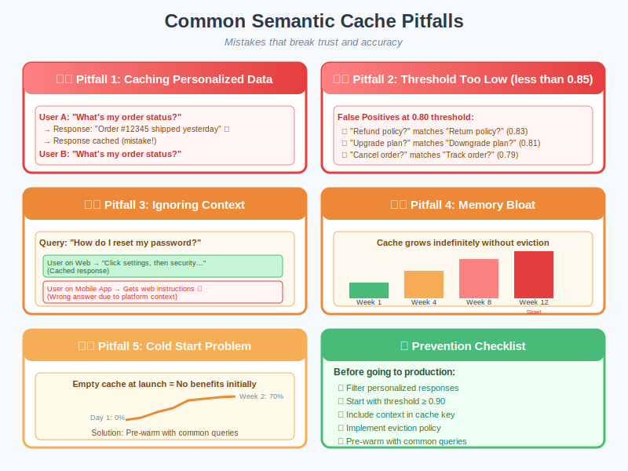

You've built your RAG system. You've mastered [context engineering](https://www.codebrains.co.in/blog/2025/ai/context-engineering-the-discipline-your-ai-system-desperately-needs "https://www.codebrains.co.in/blog/2025/ai/context-engineering-the-discipline-your-ai-system-desperately-needs"), eliminated [context rot](https://www.codebrains.co.in/blog/2025/ai/context-rot-silent-performance-killer-in-your-rag-system "https://www.codebrains.co.in/blog/2025/ai/context-rot-silent-performance-killer-in-your-rag-system"), and optimized your retrieval pipeline. Your system is lean, accurate, and well-architected.

**But here's the uncomfortable truth: you're still doing unnecessary work.**

Every time someone asks "What's your return policy?", your system springs into action. It embeds the query. Searches your vector database. Retrieves relevant chunks. Deduplicates them. Compresses the context. Sends it to the LLM. Waits for a response. **This entire pipeline runs every single time, even though you answered the exact same question five minutes ago.**

And when another user asks "How do I return an item?", your system does it all again. Different words. Same intent. Same answer. But your system doesn't know that, so it repeats the entire expensive process.

**Traditional caching doesn't help here.** A traditional cache would only match "What's your return policy?" to itself exact string match. It would miss "How do I return an item?", "Can I get a refund?", "Return process?", and dozens of other semantically identical queries.

That's where semantic cache comes in. It's the missing piece that transforms your well-engineered RAG system from good to exceptional. **Instead of matching exact strings, semantic cache understands meaning.** It recognizes that different phrasings of the same question deserve the same answer, and it serves that answer instantly without touching your retrieval pipeline or your LLM.

**If you're running RAG in production and you're not using semantic cache, you're leaving 60-80% of potential performance gains on the table.** Let me show you why.

## What is Semantic Cache?

Semantic cache is a caching layer that matches queries based on semantic similarity rather than exact string matching. Think of it like this: traditional cache is a librarian who only helps you if you ask for a book using its exact title. **Semantic cache is a librarian who understands that "the one about wizards and schools" and "Harry Potter" refer to the same book.**

From a technical standpoint, semantic cache works by:

1. **Embedding incoming queries** into vector representations that capture semantic meaning
2. **Comparing new query embeddings** to cached query embeddings using similarity metrics (typically cosine similarity)
3. **Returning cached responses** when similarity exceeds a threshold, typically 0.85-0.95
4. **Falling back to the full pipeline** when no semantically similar cached query exists

**The Key Insight:** Most users don't ask questions in unique ways. They cluster around common intents. **Semantic cache exploits this natural clustering to serve the majority of queries instantly** while still handling novel queries through your full RAG pipeline.

### Semantic Cache vs Traditional Cache: Understanding the Difference

Let's break down why traditional caching falls short for AI systems.

**Traditional Cache (Exact Match)**

Traditional caching works like this:

```
def traditional_cache_get(query):
            cache_key = hash(query)  # Exact string hash
            return cache.get(cache_key)
```

Results:

* Query: "What's your return policy?" → Cache miss, full pipeline
* Query: "What's your return policy?" (repeated) → Cache hit! Instant response
* Query: "What is your return policy?" (added "is") → Cache miss, full pipeline
* Query: "How do I return items?" → Cache miss, full pipeline
* Query: "Return policy?" → Cache miss, full pipeline

Hit rate: Maybe 15-20% if you're lucky. Every slight variation misses the cache.

**Semantic Cache (Meaning Match)**

Semantic cache works differently:

```
def semantic_cache_get(query, threshold=0.90):
            query_embedding = embed(query)
            
            # Search for semantically similar cached queries
            similar_queries = vector_search(
                query_embedding,
                cache_embeddings,
                top_k=1
            )
            
            if similar_queries[0].similarity > threshold:
                return cache.get(similar_queries[0].cache_key)
            
            return None  # Cache miss
```

Results:

* Query: "What's your return policy?" → Cache miss, full pipeline, response cached
* Query: "What's your return policy?" → Cache hit! (similarity: 1.0)
* Query: "What is your return policy?" → Cache hit! (similarity: 0.98)
* Query: "How do I return items?" → Cache hit! (similarity: 0.92)
* Query: "Return policy?" → Cache hit! (similarity: 0.89)
* Query: "Can I get a refund?" → Cache hit! (similarity: 0.87)

**Hit rate: Typically 60-80% in production systems. Massive improvement.**

## How Semantic Cache Actually Works: The Technical Deep Dive

Let's get into the mechanics. Understanding how semantic cache works under the hood is critical for implementing it correctly.

### The Core Components

**1. Query Embedding**

When a query arrives, you need to convert it into a vector representation:

```
def embed_query(query):
            # Use the same embedding model as your RAG system
            # for consistency
            embedding = embedding_model.encode(query)
            return embedding
```

**Critical:** Use the same embedding model for semantic cache that you use for your RAG retrieval. **Different models produce different vector spaces, making comparisons meaningless.**

**2. Similarity Search**

Search your cache of embedded queries for the most similar match:

```
def find_similar_cached_query(query_embedding, threshold=0.90):
            # Use the same vector search as your RAG system
            results = cache_vector_db.search(
                query_embedding,
                top_k=1,
                similarity_metric='cosine'
            )
            
            if len(results) > 0 and results[0].similarity >= threshold:
                return results[0]
            
            return None
```

**3. Cache Storage**

Store both the query embedding and the response:

```
class SemanticCacheEntry:
            def __init__(self, query, query_embedding, response, metadata):
                self.query = query  # Original query text
                self.query_embedding = query_embedding
                self.response = response  # Cached LLM response
                self.metadata = &#123;
                    'created_at': datetime.now(),
                    'hit_count': 0,
                    'last_accessed': datetime.now(),
                    **metadata
                &#125;
```

**4. Cache Update Strategy**

Decide when to cache responses:

```
def should_cache_response(query, response, confidence):
            # Only cache high-confidence responses
            if confidence &lt; 0.85:
                return False
            
            # Don't cache personalized responses
            if is_personalized(response):
                return False
            
            # Don't cache time-sensitive responses
            if contains_temporal_info(response):
                return False
            
            return True
```

### The Complete Semantic Cache Pipeline



Semantic Cache Pipeline Flow - showing the complete flow from query to cache hit/miss to response

## Why Semantic Cache is a Game-Changer for RAG Systems

Semantic cache isn't just an optimization. It's a fundamental shift in how you think about serving AI queries. Here's why it matters so much.

### Performance Gains That Actually Matter

**Production impact from a documentation chatbot:** With 70% hit rate Semantic cache, it can reduce average latency from seconds to under a second which is a significant improvement. Throughput would jump from hundred to couple hundred queries/second. Cost per 1,000 queries can be dropped significantly as well.

**These aren't marginal improvements. They're transformational.**

### Cost Reduction That Impacts Unit Economics

**LLM API calls are expensive. Every query that hits your cache instead of your LLM is money saved.**

**Example:** A system handling 1 million queries per month with 70% cache hit rate saves approximately $38,450/month ($461,400/year) in LLM costs. **For larger systems handling tens of millions of queries, we're talking about millions in annual savings.**

### User Experience That Feels Magical

Here's something that doesn't show up in metrics but matters immensely: **instant responses feel magical to users.**

**When a user asks a question and gets an answer in 200 milliseconds instead of 3 seconds, their perception of your AI changes.** It feels smarter. More responsive. More reliable.

This psychological impact compounds. **Users trust instant systems more. They use them more frequently. They recommend them to colleagues.** Semantic cache doesn't just improve technical metrics it improves adoption.

### Scaling Headroom You Desperately Need

Every AI system eventually hits scaling limits. Your LLM provider has rate limits. Your vector database has throughput limits. Your infrastructure has cost limits.

**Semantic cache gives you scaling headroom by reducing load on your bottlenecks. If 70% of queries hit the cache, you've effectively 3.3x your capacity without touching infrastructure.** That's the difference between handling growth gracefully and scrambling to optimize under pressure.

## The Similarity Threshold: The Most Important Decision

**The similarity threshold is the single most important parameter in your semantic cache.** Set it too high, and you miss opportunities for cache hits. Set it too low, and you serve incorrect responses. Let's figure out how to get it right.

### What the Threshold Actually Means

When comparing two query embeddings using cosine similarity, you get a score between -1 and 1:

* **1.0:** Identical embeddings (exact same query or semantically identical)
* **0.95-0.99:** Nearly identical meaning with minor phrasing differences
* **0.85-0.94:** Same intent, different wording
* **0.70-0.84:** Related topics, but potentially different specific questions
* **Below 0.70:** Different questions

### Finding Your Optimal Threshold

The optimal threshold depends on your domain and risk tolerance. Here's how to find it:

**Step 1: Collect Query Pairs**

Gather actual queries from your users and label them:

* **Identical intent:** "What's your return policy?" vs. "How do I return items?"
* **Different intent:** "What's your return policy?" vs. "What's your shipping policy?"

**Step 2: Calculate Similarity Distributions**

```
def analyze_similarity_distribution(query_pairs):
            identical_intent_similarities = []
            different_intent_similarities = []
            
            for pair in query_pairs:
                emb1 = embed(pair.query1)
                emb2 = embed(pair.query2)
                sim = cosine_similarity(emb1, emb2)
                
                if pair.same_intent:
                    identical_intent_similarities.append(sim)
                else:
                    different_intent_similarities.append(sim)
            
            return identical_intent_similarities, different_intent_similarities
```

**Step 3: Visualize the Distributions**

Plot both distributions. You're looking for a threshold that maximizes true positives (correct cache hits) while minimizing false positives (incorrect cache hits).

In most domains, you'll find:

* **0.92-0.95:** Conservative threshold, high precision, moderate recall
* **0.88-0.91:** Balanced threshold, good precision and recall
* **0.85-0.87:** Aggressive threshold, moderate precision, high recall

**Step 4: A/B Test Different Thresholds**

Run experiments in production:

```
def ab_test_thresholds():
            thresholds_to_test = [0.88, 0.90, 0.92]
            
            for threshold in thresholds_to_test:
                metrics = &#123;
                    'cache_hit_rate': 0,
                    'false_positive_rate': 0,
                    'user_satisfaction': 0,
                    'latency_p50': 0,
                    'latency_p95': 0,
                &#125;
                
                # Run for 1 week, collect metrics
                # Analyze and choose optimal threshold
```

### Dynamic Thresholds: The Advanced Approach

Different query types might benefit from different thresholds:

```
def get_dynamic_threshold(query):
            query_type = classify_query(query)
            
            thresholds = &#123;
                'factual': 0.88,  # More lenient for factual queries
                'troubleshooting': 0.92,  # More strict for complex queries
                'account_specific': 0.95,  # Very strict for personalized queries
            &#125;
            
            return thresholds.get(query_type, 0.90)
```

## The Freshness Problem: When Cache Becomes a Liability

**Here's the dark side of caching: stale responses.** You update your documentation. You fix a bug. You change a policy. But your semantic cache is still serving the old answer. **This is how cache becomes a liability instead of an asset.**

### Understanding Cache Staleness

Staleness occurs when:

* Source documents change but cached responses don't update
* Time-sensitive information expires (e.g., "current promotions")
* Product features change but cache reflects old behavior
* Policies update but cache serves outdated policies

**Left unmanaged, stale cache erodes user trust faster than no cache at all.** Users expect current information. Serving outdated answers is worse than being slow.

### Cache Invalidation Strategies

**Strategy 1: Time-Based Expiration (TTL)**

The simplest approach: every cached entry expires after a fixed time.

TTL guidelines by content type:

* **Static content (policies, procedures):** 7-30 days
* **Semi-static content (product docs):** 24-72 hours
* **Dynamic content (status, availability):** 1-6 hours
* **Time-sensitive content (promotions):** 30-60 minutes

**Strategy 2: Version-Based Invalidation**

Track source document versions and invalidate when they change:

* Store document version numbers with each cached entry (e.g., "doc\_123: v1.2")
* When a document updates, increment its version number
* Compare cached version against current version before serving
* If versions don't match, invalidate the cache entry automatically
* Bulk invalidation: when one document updates, find and delete all cache entries referencing it

**Strategy 3: Confidence-Based Refresh**

For high-traffic queries, periodically re-compute responses in the background and compare:

* Identify top 100 most-hit queries (update weekly)
* Run background job (nightly) to regenerate responses for these queries
* Compare new response to cached response using similarity scoring
* If similarity drops below 0.90, response has drifted significantly → update cache
* Log all drift events for manual review and pattern analysis

**Strategy 4: Hybrid Approach (Recommended)**

Combine multiple strategies for robust freshness management:

* **First check TTL:** If entry is expired (past 24-72 hours), invalidate immediately
* **Then check versions:** If source documents have changed, invalidate regardless of age
* **For popular queries (1000+ hits):** Apply stricter validation, re-check more frequently
* **Result:** Layered defense against stale cache without over-invalidation



Cache Invalidation Strategies - showing TTL, version-based, and confidence-based refresh approaches

## Common Pitfalls: Where Semantic Cache Goes Wrong

**Semantic cache is powerful, but it's easy to implement incorrectly.** Here are the mistakes I see teams make repeatedly, and how to avoid them.

### Pitfall 1: Caching Personalized Responses

**The Problem:** You cache a response that includes user-specific information, then serve it to other users.

**The Solution:** Never cache responses containing user-specific data:

### Pitfall 2: Ignoring Context Dependency

**The Problem:** Two queries might be semantically similar but require different answers based on context.

**The Solution:** Include context in your cache key:

### Pitfall 3: Threshold Too Low

**The Problem:** Setting threshold to 0.80 to maximize hit rate results in serving incorrect answers.

**The Solution:** Monitor false positive rate and prioritize precision over recall:

### Pitfall 4: Cold Start Problem

**The Problem:** When you launch semantic cache, it's empty. Users get no benefit until the cache warms up.

**The Solution:** Pre-populate cache with common queries:

### Pitfall 5: Memory Bloat

**The Problem:** Cache grows indefinitely, consuming memory and slowing similarity search.

**The Solution:** Implement cache eviction policies:



Common Pitfalls Visualization - showing examples of personalization leaks, context mismatches, and cache bloat

## Advanced Patterns: Taking Semantic Cache Further

Once you have basic semantic cache working, these advanced patterns unlock even more value.

### Pattern 1: Multi-Tier Semantic Cache

Not all queries are equal. High-traffic queries deserve different treatment than long-tail queries.

**The Three-Tier Architecture:**

* **Tier 1 - Hot Cache (In-Memory):** Stores the top 1,000 most frequently accessed queries. Ultra-fast lookup in 1-2ms. Perfect for queries that get hit multiple times per second.
* **Tier 2 - Warm Cache (Redis):** Stores up to 50,000 medium-traffic queries. Fast lookup in 5-10ms. Handles queries that get hit multiple times per day.
* **Tier 3 - Cold Cache (Vector Database):** Stores up to 1 million long-tail queries. Semantic search in 50-100ms. Handles everything else.

**How Promotion Works:**

* Query first checks Tier 1 (fastest). If miss, check Tier 2.
* If Tier 2 hit, serve response and optionally promote to Tier 1 if hit count is high.
* If Tier 2 miss, check Tier 3 with semantic search.
* If Tier 3 hit and query becomes popular (10+ hits), promote to Tier 2.
* Responses naturally float up to faster tiers based on usage patterns.

**Benefits:** Popular queries get sub-millisecond responses while still handling long-tail queries efficiently. Optimizes both speed and coverage.

### Pattern 2: Partial Response Caching

Cache intermediate results instead of just final responses.

**The Strategy:**

* **Cache the retrieval step:** When you search your vector database for relevant documents, cache those results separately for 1-6 hours.
* **Generate fresh responses:** Use the cached documents but generate personalized or context-specific responses for each user.
* **Best of both worlds:** Skip the expensive retrieval operation (which might take 200-500ms) while still providing personalized answers.

**Example Use Case:**

* Multiple users ask variations of "What are the features of your Pro plan?"
* Retrieval returns the same relevant documents (cached once).
* Each user gets a response personalized to their current plan, usage, or industry.
* You save 70% of the processing time while maintaining personalization.

**When to Use This:**

* Similar queries need slightly different answers based on user context
* Retrieval is expensive but response generation is fast
* Personalization is required but the source information is the same
* You want to cache something but can't cache the final response

### Pattern 3: Confidence-Gated Cache

Only serve cached responses when you're highly confident they're correct.

**Confidence Score Components:**

* **Semantic Confidence (60% weight):** How similar is the new query to the cached query? Scores above 0.92 indicate strong match.
* **Temporal Confidence (30% weight):** How fresh is the cached response? Decays from 1.0 to 0.0 over 30 days.
* **Usage Confidence (10% weight):** How many times has this cached response been used successfully? Popular responses are more trustworthy.

**Confidence Thresholds:**

* **Composite confidence ≥ 0.95:** Serve cached response immediately (high confidence).
* **Composite confidence 0.85-0.94:** Serve cached response but log for review (medium confidence).
* **Composite confidence &lt; 0.85:** Skip cache and run full RAG pipeline (low confidence).

**Why This Matters:**

* Prevents serving stale or marginally relevant cached responses
* Automatically adapts to content freshness without manual TTL management
* Builds trust over time as popular responses prove themselves
* Prioritizes accuracy over speed when confidence is uncertain

### Pattern 4: A/B Test Caching

Use cache to run experiments efficiently and measure impact.

**Experiment Setup:**

* **Control Group (50% of users):** Always use full RAG pipeline, ignore cache completely. Measures baseline performance.
* **Treatment Group (50% of users):** Use semantic cache when available. Measures cache impact.
* **Consistent assignment:** Use user ID hash to ensure each user always sees the same variant.

**Metrics to Track:**

* **Latency:** Is treatment group actually faster? By how much?
* **Accuracy:** Does cache maintain accuracy or cause degradation?
* **User Satisfaction:** Do users prefer the faster cached responses?
* **Cost per Query:** Quantify exact savings from cache hits.

**Common Findings:**

* Treatment group typically shows 70-80% latency reduction
* Slight accuracy drop (1-2%) is usually acceptable given speed gains
* User satisfaction often increases despite minor accuracy trade-off
* Cost savings validate the infrastructure investment

### Pattern 5: Semantic Cache as RAG Preprocessor

Use semantic cache to identify common intents before RAG retrieval.

**Intent Caching Strategy:**

* **Cache discovered intents:** When you process a query, classify its intent (e.g., "refund\_policy", "account\_management", "troubleshooting").
* **Store intent mappings:** Cache the query → intent mapping using semantic similarity.
* **Optimize future retrieval:** When similar queries arrive, use the cached intent to target retrieval more precisely.

**Example Flow:**

* User asks: "What's your return policy?" → System discovers intent: "refund\_policy" → Caches the intent mapping.
* Next user asks: "How do I get a refund?" → Semantic match finds cached intent: "refund\_policy" → Direct retrieval to refund-related documents only.
* Result: Faster, more focused retrieval without broad vector search.

**Benefits:**

* Reduces retrieval time by 40-60% for recognized intents
* Improves retrieval precision by focusing on relevant document clusters
* Learns common user patterns over time
* Works alongside full semantic caching for compound benefits

**Best Use Cases:**

* Customer support with 10-20 common intent categories
* Documentation search with clear topic boundaries
* FAQ systems where questions cluster around known topics
* Any domain where user queries follow predictable patterns

## Measuring Success: The Metrics That Matter

You can't improve what you don't measure. Here are the key metrics for semantic cache performance.

### Primary Metrics

**1. Cache Hit Rate**

```
hit_rate = cache_hits / total_queries
```

Target: 60-80% for production systems

**2. Cache Miss Rate**

```
miss_rate = cache_misses / total_queries = 1 - hit_rate
```

Target: 20-40%

**3. False Positive Rate**

```
false_positive_rate = incorrect_cache_hits / cache_hits
```

Target: &lt; 2% (this is critical for user trust)

**4. Latency Improvement**

```
latency_improvement = (avg_latency_without_cache - avg_latency_with_cache) / avg_latency_without_cache
```

Target: 70-90% reduction for cache hits

**5. Cost Savings**

```
cost_savings = (cache_hit_rate * avg_cost_per_llm_call * total_queries)
```

### Secondary Metrics

**6. Cache Efficiency Score**

```
efficiency = (hit_rate * accuracy) / cache_size_mb
```

Measures bang-for-buck: are you getting good hit rates relative to cache size?

**7. Similarity Distribution**

Track the distribution of similarity scores for cache hits. If most hits are at 0.90-0.92 (just above threshold), your threshold might be too low.

**8. Cache Staleness Rate**

```
staleness_rate = expired_entries / total_cache_entries
```

High staleness suggests your TTL might be too aggressive.

## Semantic Cache and the Broader AI Stack

**Semantic cache doesn't exist in isolation. It's part of a larger system.** Here's how it integrates with other components we've discussed.

### Semantic Cache + Context Engineering

**Context engineering reduces the tokens you send to your LLM. Semantic cache reduces how often you send any tokens at all.** They're complementary:

* **Context engineering optimizes cache misses:** When you do hit the LLM, you're sending optimized context
* **Semantic cache optimizes cache hits:** For common queries, you skip context assembly entirely

**Together, they create a system that's both fast (cache hits) and efficient when it needs to think (cache misses with good context).**

### Semantic Cache + Context Rot Prevention

Remember [context rot](https://www.codebrains.co.in/blog/2025/ai/context-rot-silent-performance-killer-in-your-rag-system "https://www.codebrains.co.in/blog/2025/ai/context-rot-silent-performance-killer-in-your-rag-system")? It happens when your context degrades over time. Semantic cache introduces a related but distinct problem: cache staleness.

The solution? Combine freshness strategies:

* Regular embedding refresh (prevents context rot)
* Cache invalidation on content changes (prevents stale cache)
* Version tracking across both systems

### Semantic Cache + MCP

Model Context Protocol enables dynamic context loading. Semantic cache can optimize this:

```
async def handle_query_with_cache_and_mcp(query):
            # Check cache
            cached = await semantic_cache.get(query)
            if cached:
                return cached
            
            # Cache miss - use MCP for dynamic context
            relevant_resources = await mcp.discover_resources(query)
            context = await mcp.load_resources(relevant_resources)
            
            response = await llm.generate(query, context)
            
            # Cache response with MCP resource fingerprints
            await semantic_cache.set(
                query,
                response,
                resource_versions=relevant_resources.versions
            )
```

## Key Takeaways: What You Need to Remember

### The Essential Points

* **Semantic cache is about meaning, not strings:** It recognizes that "How do I return items?" and "What's your return policy?" are the same question, even though traditional caching can't.
* **The performance gains are transformational:** 60-80% hit rates translate to 70-90% latency reductions and 60-70% cost savings. These aren't marginal improvements.
* **The similarity threshold is critical:** Start at 0.90, measure false positives, adjust carefully. Too low causes incorrect responses. Too high misses opportunities.
* **Freshness management isn't optional:** Stale cache is worse than no cache. Implement TTL, version-based invalidation, or both.
* **Don't cache everything:** Personalized responses, time-sensitive data, and context-dependent answers should never be cached.
* **Start simple, add sophistication:** Basic semantic cache provides 80% of the value. Multi-tier caching and advanced patterns are for optimization after you have the basics working.
* **Measure everything:** Hit rate, false positives, latency improvement, and cost savings. What gets measured gets optimized.
* **Semantic cache compounds with context engineering:** Together, they create systems that are fast when they can be (cache hits) and efficient when they need to think (cache misses with optimized context).

## What's Next: Corrective RAG

**You now understand how semantic cache accelerates your RAG system by recognizing when you've already answered a question.** But here's a question we haven't addressed: what happens when your RAG system retrieves the wrong documents?

**Even with perfect retrieval engineering, sometimes your vector search returns irrelevant chunks.** Or it returns mostly relevant chunks with a few distractors mixed in. Traditional RAG has no mechanism to detect and correct these retrieval failures. It just sends everything to the LLM and hopes for the best.

That's where **Corrective RAG (CRAG)** comes in.

**Corrective RAG adds a self-correction mechanism to your retrieval pipeline.** Before sending retrieved documents to the LLM, it evaluates their relevance. If the documents are high quality, it proceeds normally. If they're low quality or irrelevant, it triggers corrective actions: web search, knowledge base expansion, or query reformulation.

**It's like having a quality control inspector in your RAG pipeline** who says "wait, these documents don't actually answer the question" and takes corrective action before wasting expensive LLM tokens on bad context.

In our next blog, we'll dive deep into Corrective RAG:

* How CRAG detects retrieval quality issues automatically
* The three corrective actions: filter, search, and reformulate
* When to use CRAG vs traditional RAG
* Implementation patterns and real-world results
* How CRAG integrates with semantic cache for even better performance

**Corrective RAG represents the next evolution in retrieval systems: not just finding documents, but actively ensuring the documents you find actually help answer the question.** Combined with semantic cache and context engineering, it completes the trifecta of production-ready RAG systems that are fast, accurate, and self-correcting.

What's your experience with caching in AI systems? Have you implemented semantic cache, or are you still using traditional caching? What challenges have you faced with cache freshness and false positives? I'd love to hear about your experiences and approaches – connect with me on [LinkedIn](https://www.linkedin.com/in/ankitgubrani/ "https://www.linkedin.com/in/ankitgubrani/").