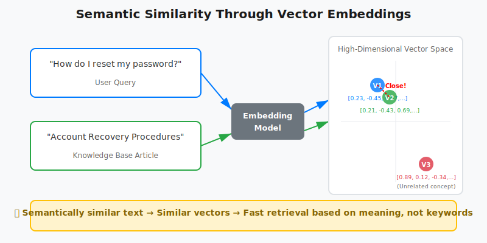
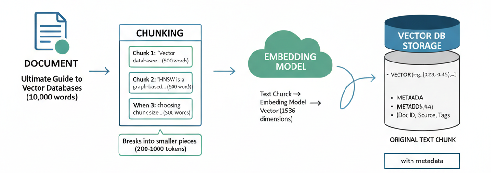
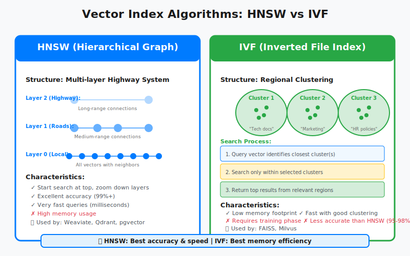
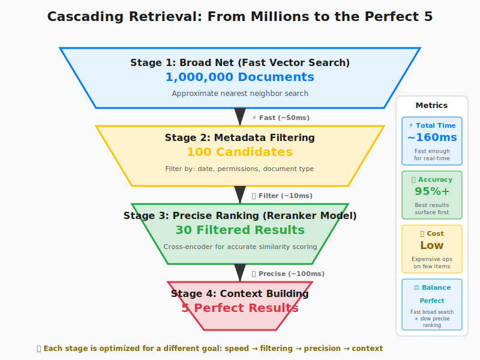

You've built your first RAG system following [our guide to RAG fundamentals](https://www.codebrains.co.in/blog/2025/ai/what-is-rag-retrieval-augmented-generation-guide "https://www.codebrains.co.in/blog/2025/ai/what-is-rag-retrieval-augmented-generation-guide"). You understand when to use [RAG vs CAG vs KAG](https://www.codebrains.co.in/blog/2025/ai/rag-vs-cag-vs-kag-choosing-right-augmentation-strategy "https://www.codebrains.co.in/blog/2025/ai/rag-vs-cag-vs-kag-choosing-right-augmentation-strategy"). But there's a question that keeps popping up: **How does the system actually find relevant documents so fast?**

You have 100,000 documents. A user asks a question. Somehow, in less than a second, your system finds the 5 most relevant documents from that massive collection. It's not searching through every document one by one that would take forever. So what's happening behind the scenes?

The answer is **vector databases**. Vector databases are the unsung heroes of modern AI applications. They make it possible for large language models (LLMs) to search, compare, and retrieve relevant pieces of information quickly even when you don’t phrase your query exactly the same way as the stored data.

This is the third post in my "**AI Building Blocks for the Modern Web**" series, where I break down core AI concepts and show how they apply to real-world applications. Today, we're diving deep into the engine that powers semantic search.

## The Problem: Traditional Databases Don't Understand Meaning

Imagine you're building a customer support chatbot. A user asks: "How do I reset my password?" Your knowledge base has an article titled "Account Recovery Procedures." A traditional SQL database running a keyword search would struggle here. Why? Because "reset password" and "account recovery" share zero words in common, even though they mean essentially the same thing.

This is where vector databases fundamentally change the game. **They don't search for matching words they search for matching meaning.**

## What Actually is a Vector Database?

A vector database is a specialized database designed to store, index, and query high-dimensional vectors efficiently. But what does that actually mean in practice?

**When you feed text into an embedding model (like OpenAI's text-embedding-3-small or Cohere's embed models), it converts that text into a list of numbers called a vector. These numbers encode the semantic meaning of the text. Similar concepts get similar numbers, regardless of the exact words used.**

For example:

* "How do I reset my password?" might become [0.23, -0.45, 0.67, ... 1536 more numbers]
* "Account recovery steps" might become [0.21, -0.43, 0.69, ... 1536 more numbers]

Notice how the vectors are similar? That's the magic. **The database can now find semantically similar content by finding vectors that are close together in this high-dimensional space.**



## How Vector Databases Differ from Traditional Databases

Let's be clear about what makes vector databases different from the databases you're already using:

**Traditional Relational Databases (PostgreSQL, MySQL):**

* Optimized for exact matches and structured queries
* Search by comparing exact values: WHERE name = 'John'
* Use B-tree indexes for fast lookups
* Perfect for transactional data, user records, orders

**Vector Databases (Pinecone, Weaviate, Qdrant):**

* Optimized for similarity searches
* Search by comparing vector distances in high-dimensional space
* Use specialized indexes (HNSW, IVF) for approximate nearest neighbor search
* Perfect for semantic search, recommendation systems, RAG applications

The fundamental difference? **Relational databases answer "show me exact matches," while vector databases answer "show me what's most similar."**

That said, many traditional databases now offer vector extensions. PostgreSQL has pgvector, and MongoDB has vector search capabilities. But dedicated vector databases still have significant advantages in performance, scale, and specialized features for similarity search.

## How Data Lives Inside a Vector Database

When you're building a RAG system, you can't just dump entire documents into a vector database and expect magic. The process requires careful preparation:

### The Chunking Step

First, you break your documents into smaller, meaningful pieces called chunks. Why? **Because embedding models have token limits, and more importantly, smaller chunks lead to more precise retrieval.**

```
Document: "Ultimate Guide to Vector Databases (10,000 words)"
↓
Chunk 1: "Vector databases store high-dimensional vectors..." (500 words)
Chunk 2: "HNSW is a graph-based indexing algorithm..." (500 words)
Chunk 3: "When choosing chunk size, consider..." (500 words)
```

The art is in choosing the right chunk size. **Too small, and you lose context. Too large, and your retrieval becomes imprecise**. Most production systems use chunks of 200-1000 tokens, depending on the use case.

### The Embedding Process

Each chunk then goes through an embedding model, which converts the text into a vector. These vectors are what actually get stored in the database.
**Think of embeddings as a universal translator, they convert human language into a mathematical representation that computers can compare and measure.** The same embedding model must be used for both storing your documents and processing user queries, ensuring they live in the same semantic space.

```
Text Chunk → Embedding Model → Vector (1536 dimensions)
"Vector databases store..." → [0.23, -0.45, 0.67, ...]
```

### Storage Structure

Inside the database, you're typically storing:

* The vector itself (the numerical representation)
* Metadata (document ID, source, timestamp, tags)
* Often the original text chunk (for returning to the user)



## Why Vector Databases are Essential for RAG

Remember our RAG pipeline from the previous post? The retrieval step is where vector databases shine. Here's what happens:

1. **User asks a question:** "What's the difference between FAISS and Pinecone?"
2. **Query embedding:** The question gets converted to a vector
3. **Similarity search:** The vector database finds the top-k most similar vectors
4. **Context retrieval:** The database returns the original text chunks associated with those vectors
5. **LLM generation:** The LLM uses those chunks as context to generate an answer

The vector database makes this process incredibly fast. **Instead of the LLM reading through thousands of documents, it only sees the 3-5 most relevant chunks. This is both more efficient and more accurate.**

## The Naive Approach: Why You Can't Just Send Everything

You might be thinking: **"Can't I just send all my documentation to the LLM and skip the vector database entirely?"**

Technically, yes. Practically? That's a terrible idea. Here's why:

#### 1. Context Window Limitations

**Even with models that support 128k+ tokens, you're still limited**. A mid-sized documentation set easily exceeds this. Your entire Notion workspace? Not happening.

#### 2. Cost Explosion

**You pay per token processed**. Sending 50,000 tokens on every request adds up fast. With RAG and vector databases, you might only send 2,000 tokens of relevant context.

#### 3. Latency Issues

**Processing massive contexts takes time**. Your users won't wait 30 seconds for an answer when they could get one in 2 seconds with proper retrieval.

#### 4. Needle in a Haystack Problem

**Research shows that LLMs struggle when relevant information is buried in massive contexts**. They perform better with concise, relevant context exactly what vector databases provide.

## Speeding Up Similarity Search: Why Indexes Matter

Here's where things get technical, but stick with me this matters for production systems.

When you have millions of vectors, comparing your query vector against every single stored vector (brute force search) is too slow. Vector databases use specialized indexing algorithms to approximate the nearest neighbors quickly.

### Popular Indexing Approaches

#### HNSW (Hierarchical Navigable Small World)

Think of it as a multi-layered highway system. The top layer has major highways connecting distant cities. Lower layers have local roads with more detail. When searching, you start on the highway and progressively zoom in.

* **Pros:** Excellent speed and accuracy balance
* **Cons:** High memory usage
* **Used by:** Weaviate, Qdrant, pgvector

#### IVF (Inverted File Index)

The database divides vector space into regions (like states on a map). During search, it only looks in the regions most likely to contain your answer.

* **Pros:** Memory efficient
* **Cons:** Requires training, less accurate than HNSW
* **Used by:** FAISS, Milvus



The key insight? These indexes trade perfect accuracy for massive speed improvements. A 99% accurate result in 10ms beats a 100% accurate result in 10 seconds for most applications.

## Vector Index vs Vector Database: What's the Actual Difference?

This confuses a lot of developers, so let's clear it up.

### Vector Index (like FAISS)

FAISS (Facebook AI Similarity Search) is a library,a piece of code you run in your application. It's brilliant at similarity search but it's just the algorithm, not a complete system.  **Think of it like having a really fast sorting function, it does one thing exceptionally well, but you still need to build everything around it**. You're responsible for persisting the data to disk, handling crashes and recovery, scaling across multiple servers, and managing all the operational complexity.

It's brilliant at similarity search but:

* No built-in persistence (you manage storage yourself)
* No distributed architecture out of the box
* No access control or multi-tenancy
* You handle backups, scaling, monitoring

Think of FAISS like a sorting algorithm. It's a tool, not a complete solution.

### Vector Database (like Pinecone, Weaviate, Qdrant)

A complete database system built around vector operations. **These are production-ready platforms that handle all the infrastructure complexity for you.** They're designed from the ground up for vector workloads, with built-in replication, automatic backups, monitoring dashboards, and APIs that let you focus on building your application instead of managing servers.

**Features include:**

* Persistent storage with backups
* Distributed and scalable architecture
* Built-in monitoring and observability
* Access control and security
* Multiple index types and configurations
* APIs for easy integration

```
FAISS: In-memory index that you embed in your application
Vector DB: Complete managed system that your application connects to
```

**In Summary: For prototyping or small projects, FAISS is perfect. For production systems handling real users and real data, you want a proper vector database.**

## Advanced Retrieval: The Cascading Approach

Here's a pattern that's gaining traction in production RAG systems: **Cascading Retrieval**. Instead of one big search, you do multiple searches with increasing precision.

***Why does this matter?* Because the fastest algorithms aren't always the most accurate, and the most accurate algorithms aren't always fast enough.** Cascading retrieval lets you have both: you use fast, approximate methods to quickly narrow down from millions of candidates, then apply slower, more precise methods only to the small subset that remains. It's the same strategy search engines like Google use: broad matching first, then sophisticated ranking on the top results.

This approach also mirrors how humans search for information. You don't carefully read every book in a library, you first identify the right section, then the right shelf, then scan titles, and only then do you read in detail. **Cascading retrieval applies this same natural hierarchy to machine learning systems.**

#### Stage 1: Broad Net (Fast)

Use a less precise but faster index to retrieve the top 100 candidates from your entire corpus.

#### Stage 2: Refined Filter (Metadata)

Apply metadata filters (date range, document type, user permissions) to narrow down to 30 relevant candidates.

#### Stage 3: Precise Ranking (Slow but Accurate)

Use a more expensive reranking model or cross-encoder to identify the absolute best 5 results.

#### Stage 4: Context Building

Fetch surrounding chunks or related sections to provide richer context to the LLM.

