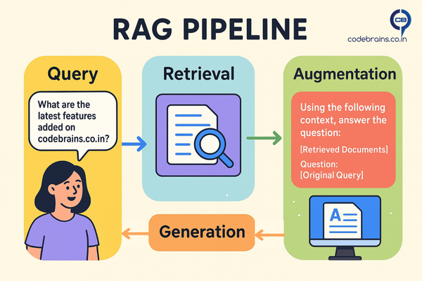

We've all been amazed by Large Language Models (LLMs) they can write poems, code, and answer complex questions. It almost feels like magic, right? But here's the thing: their knowledge is frozen in time. They can't tell you about a new company policy from last week or the latest features in your product. That's a huge problem for any real-world application. How do we give these models access to fresh, relevant, and specific information without retraining them? The answer is RAG, or Retrieval-Augmented Generation.

## What is RAG? Breaking Down the Buzzword

RAG is a technique that gives an LLM access to external knowledge. Think of it like this: an LLM without RAG is a brilliant student who only knows what they learned in class. RAG gives that student a vast, searchable library to reference. When you ask a question, the student first quickly looks up the relevant books and notes, then uses that newfound information to formulate a precise answer.

From a technical standpoint, **Retrieval-Augmented Generation** is an architectural pattern that combines a retriever and a generator. The retriever finds the most relevant documents or chunks of data from a large knowledge base, and the generator (the LLM) uses those retrieved documents as context to produce a well-informed response. This process fundamentally enhances the LLM's ability to provide accurate, up-to-date, and grounded answers, reducing the risk of "hallucinations" or generating incorrect information.

## Why Retrieval Changes Everything for LLMs

LLMs are trained on massive, but fixed, datasets. They've seen countless websites, books, and articles up to a certain point in time. This creates two major limitations:

1. **Stale Knowledge:** The model can't access information that was created after its training cut-off date. For example, a model trained in 2023 won't know about events that occurred in 2025 unless it is retrained, which is incredibly expensive and time-consuming.
2. **Lack of Specificity:** LLMs lack knowledge about your specific organization, your private documents, or your product's internal workings. You can't ask a public LLM about your company's HR policies or a specific customer's order history.

RAG solves both these problems by acting as a bridge. It connects the static, general knowledge of the LLM with the dynamic, specific knowledge of your private data sources.

## RAG Use Cases

The power of RAG lies in its versatility. Here are a few common use cases that highlight its value:

* **Customer Support Chatbots:** Imagine a chatbot that can answer questions about your product's specific features or troubleshoot common issues by retrieving information directly from your product documentation.
* **Internal Knowledge Base Q&A:** An employee can ask a bot a question like, "What is our leave policy for parental leave?" The bot retrieves the relevant section from the company's internal wiki and provides a direct, accurate answer.
* **Documentation Search:** Instead of sifting through pages of documentation, an engineer can ask a natural language question about a specific API endpoint, and RAG can pull the exact code snippet and description they need.

## How RAG Works: The Architecture Breakdown

Let's break down how RAG works with a simple pipeline diagram and a conceptual code snippet.

1. **User Query:** A user asks a question like "What are the latest features added on codebrains.co.in?"
2. **Retrieval:** The query is used to search a knowledge base (often a vector database) for semantically similar documents. For our example, this would be a search through documents describing new features added to codebrains.co.in . The retriever finds the most relevant document chunks.
3. **Augmentation:** The LLM is then given a prompt that includes the original query and the retrieved document chunks as additional context. The prompt looks something like: "Using the following context, answer the question: [Retrieved Documents] \n\n Question: [Original Query]"
4. **Generation:** The LLM uses this combined information to generate a well-informed and grounded response.

## Why RAG is Becoming the Backbone of Production AI Systems

RAG is not just a theoretical concept; it's rapidly becoming the standard for building practical AI applications. Here's why:

* **Cost effective:** Training or fine-tuning large models every time your data changes is expensive. With RAG, you only update your knowledge base, not the model itself.
* **Always up-to-date:** Because RAG retrieves the latest information from your data sources, the answers stay current without constant retraining.
* **More reliable:** LLMs often “hallucinate.” By grounding responses in retrieved documents, RAG makes outputs more factual and trustworthy.
* **Proven in production:** Many enterprise AI copilots, customer support assistants, and search experiences are already powered by RAG under the hood.

## Key Takeaways: Why RAG Matters for Your Architecture

RAG is more than just a buzzword; it's a foundational pattern for building practical, reliable, and up-to-date LLM applications.

#### Key Takeaways:

1. **RAG solves the knowledge cutoff problem**  that makes traditional AI implementations frustrating in real-world scenarios.
2. **It's not just about accuracy** it's about building AI systems that stay current and relevant without constant retraining.
3. **For marketing and content teams,** RAG enables personalization at scale by connecting AI to your actual content library.
4. **Start simple:** You don't need a complex architecture to see value. A basic RAG implementation can be built and deployed in days, not months.
5. **Think beyond chatbots:** RAG powers content discovery, automated research, competitive analysis, and dozens of other use cases that matter to business outcomes.

The AI landscape is moving fast, but RAG has proven itself as more than a trend it's becoming the foundation for AI systems that actually work in production. Whether you're building customer support tools, internal knowledge bases, or marketing automation, understanding RAG isn't just useful it's essential.

Ready to build your first RAG system? ***In our next post, we'll dive into when to choose RAG vs other approaches like CAG (Cache Augmented Generation) and KAG (Knowledge Augmented Generation)***. Spoiler alert: the answer isn't always "just use RAG."

**What's your experience with RAG implementations?** I'd love to hear about your use cases and challenges connect with me on [LinkedIn](https://www.linkedin.com/in/ankitgubrani/ "https://www.linkedin.com/in/ankitgubrani/").