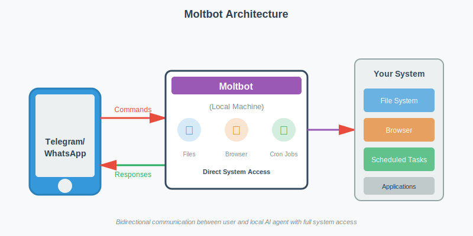
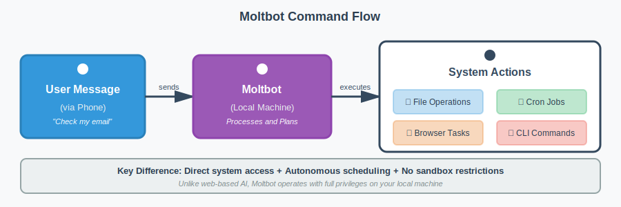
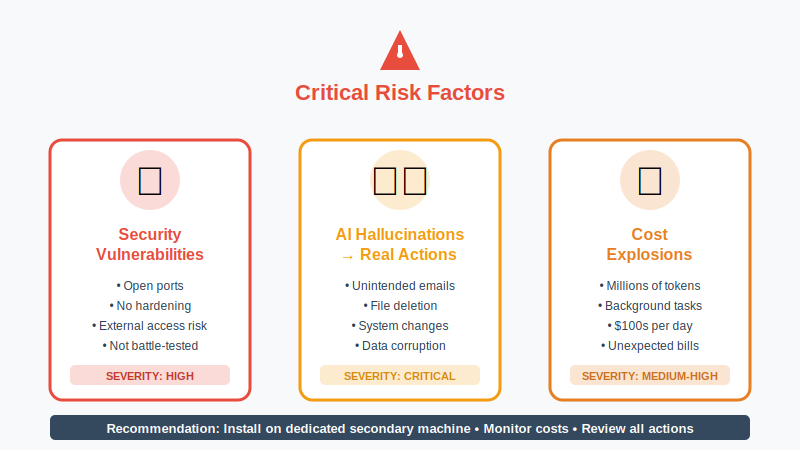

Remember Jarvis from Iron Man? Tony Stark's AI assistant that could control his home, manage his lab, pilot his suits, and proactively alert him to threats. For years, that level of AI autonomy has been pure science fiction. Until now.

In the fast-moving world of AI, a new tool is creating buzz across developer communities: **Moltbot** (recently renamed from Clawdbot). Unlike the chatbots we're used to, Moltbot runs locally on your machine with direct system access, functioning more like a true digital assistant than a conversational AI. While there's plenty of excitement, there's also confusion about what this tool actually is and what it means to give an AI agent the keys to your computer.

This post breaks down the essentials of Moltbot: what it does, why it's different from traditional AI tools, and the precautions you should consider before deploying your own "Jarvis" on your system.

## **What is Moltbot? (And what it isn't)**

First, let's clear up a common misconception: **Moltbot is not Claude Code** (Since it was named Clawdbot earlier, there was alot of confusion). While it can leverage Claude Code to perform tasks, they are distinct entities.

Moltbot is an **open-source application that runs locally on your machine**. Think of it as a bridge between your computer and messaging platforms like Telegram or WhatsApp. Instead of logging into a web interface, you communicate with the bot through your phone, sending commands to an agent that lives directly on your hardware.

This architectural difference is significant. It shifts the AI from a remote service to a **local, always-on agent with direct system access**.

## **The Power of a Local Agent**

The most compelling (and potentially concerning) aspect of Moltbot is the **level of system access it requires**. Unlike standard web-based LLMs, Moltbot has direct access to your machine. Based on its documentation and community reports, it can:

* **File System Operations:** Create, modify, and manage files directly on your hard drive
* **Browser Automation:** Access your browser to check emails, make reservations, or interact with web applications
* **Proactive Monitoring:** Set up scheduled tasks to monitor trends on platforms like X and send automated reports

The scheduled task capability is particularly noteworthy. Through **cron jobs, Moltbot doesn't just respond to your commands. It can actively execute tasks in the background**, functioning as a truly autonomous agent rather than a reactive assistant.

## **Why Caution is Required**

With this level of autonomy comes significant risk. Because Moltbot is an **open-source tool and not a battle-tested product** from a major corporation, it operates without traditional enterprise guardrails.

### **Security Considerations**

The application **operates with open ports and hasn't undergone the same security hardening** as commercial products. This creates potential vulnerabilities for outside access.

### **The Non-Deterministic Factor**

LLMs are inherently non-deterministic. In a chat interface, a hallucination might produce an incorrect answer. With Moltbot, **a hallucination could result in**:

* Sending unintended emails to contacts
* Deleting or modifying important files
* Making unauthorized changes to your system

### **Cost Implications**

According to community reports, Moltbot can consume **millions of tokens running background tasks** and navigating websites. Some users have reported **API bills reaching hundreds of dollars in a single day**, particularly when the agent is performing extensive web browsing or complex automated workflows.

## **Getting Started**

If you're ready to experiment with Moltbot, prepare for some technical setup. **Installation requires working with a terminal/CLI** (Command Line Interface).

**Pro Tip:** If you're not comfortable with terminal commands, you can use an LLM like Claude to guide you through the installation process step-by-step.

To mitigate risks, many developers are opting to **install Moltbot on a dedicated secondary machine** (like a Mac Mini) rather than their primary development environment. This isolation approach keeps the agent separated from critical personal and work data.

## **Practical Considerations for System Design**

From a systems architecture perspective, Moltbot represents an interesting shift in how we think about AI integration. Instead of the traditional client-server model where the AI lives in the cloud, we're moving toward **edge-based autonomous agents**.

This has implications for:

* **Latency:** Local execution eliminates network round-trips for certain operations
* **Privacy:** Data doesn't need to leave your machine for processing (though API calls to Claude still occur)
* **Reliability:** Less dependence on network connectivity for basic operations
* **Control:** Direct system access enables capabilities impossible with sandboxed web applications

## **The Verdict**

Moltbot represents the next evolution in AI tooling: **moving from reactive chatbots to proactive, autonomous agents**. It's powerful, experimental, and definitely "use at your own risk."

The technology demonstrates where AI agents are heading, but it also highlights the challenges we'll need to address: **security hardening, cost management, and safeguards against unintended actions**.

For developers comfortable with experimental tools and willing to accept the risks, Moltbot offers a glimpse into the future of AI-human collaboration. Just make sure you **understand what you're unleashing before you give it the keys to your system**.

**Have you experimented with autonomous AI agents?** What safeguards do you think are essential? Share your thoughts on [LinkedIn](https://www.linkedin.com/in/ankitgubrani/ "https://www.linkedin.com/in/ankitgubrani/").